# MỤC LỤC

1. Document Control
2. Executive Summary
3. Business Context
4. Functional Requirements
5. Non Functional Requirements
6. Solution Overview
7. System Architecture
8. Data Architecture
9. Detailed Component Design
10. Message Flow & Processing
11. Security Design
12. Deployment Architecture
13. Observability & Operations
14. Testing Strategy
15. Risks and Mitigations
16. Future Roadmap
17. Appendices

# TÀI LIỆU THIẾT KẾ KỸ THUẬT (TECHNICAL DESIGN DOCUMENT - TDD)

## HỆ THỐNG: AGNOSTIC DATA INTEGRATION MIDDLEWARE (ADIM)
**Phân hệ:** Data Ingestion, Transformation, and Enterprise Delivery Engine

**Trạng thái tài liệu:** Draft (Sẵn sàng phê duyệt bởi Hội đồng Kiến trúc)

**Phiên bản:** 2.0-Enterprise

**Mục tiêu tài liệu:** Mô tả thiết kế hiện tại, hướng triển khai tiếp theo, và đích kiến trúc tương lai cho một middleware độc lập nguồn/đích, chuyển dữ liệu đầu vào thành tệp phẳng phù hợp với Xstore/Xcenter Dataloader, mà không can thiệp cấu trúc hoặc nội dung của CSDL nguồn hay CSDL đích.

## 1. PHẦN MỞ ĐẦU

- **Tiêu đề:** Tài liệu Thiết kế Kỹ thuật Hệ thống Trung gian Chuyển đổi Dữ liệu Độc lập (Agnostic Data Integration Middleware - ADIM)
- **Tác giả(s):** Đội ngũ Kiến trúc sư Phần mềm (Software Architecture Team)
- **Đội (Team):** Core Backend & Data Engineering
- **Người đánh giá (Reviewers):** Technical Lead, Head of Architecture, Security Officer
- **Được tạo vào ngày:** 24/06/2026
- **Cập nhật lần cuối:** 24/06/2026

- **Liên kết tham chiếu:** * Epic Tracking: `[JIRA-EPIC-10243] Enterprise Agnostic Middleware Integration`

- Task Core Engine: `[JIRA-TASK-55420] Mapping Engine & Schema Registry Design`
- System Requirement Document: `[CONFLUENCE-BRD-9981]`


 
## MỤC LỤC

1. Document Control
2. Executive Summary
3. Business Context
4. Functional Requirements
5. Non Functional Requirements
6. Solution Overview
7. System Architecture
8. Data Architecture
9. Detailed Component Design
10. Message Flow & Processing
11. Security Design
12. Deployment Architecture
13. Observability & Operations
14. Testing Strategy
15. Risks and Mitigations
16. Future Roadmap
17. Appendices


# MỤC LỤC TỔ CHỨC LẠI THEO CHUẨN ENTERPRISE

## Document Control
- Document Information
- Authors
- Reviewers
- Version History
- Approval Matrix
- References

## 1. Executive Summary
- Purpose
- Scope
- Objectives
- Non Goals
- Assumptions
- Constraints

## 2. Business Context
- Problem Statement
- Retail Context
- Business Drivers
- User Stories
- Success Criteria

## 3. Functional Requirements
- Functional Requirements
- Use Cases
- Business Flows
- Error Matrix

## 4. Non Functional Requirements
- Availability
- Performance
- Scalability
- Reliability
- Security
- Maintainability
- Observability
- Disaster Recovery
- SLA / SLO

## 5. Solution Overview
- High Level Architecture
- Architectural Principles
- Design Decisions
- Technology Stack
- Integration Patterns
- Design Patterns

## 6. System Architecture
- Conceptual Architecture Diagram
- Logical Architecture Diagram
- Physical Architecture Diagram
- C4 Context Diagram
- C4 Container Diagram
- C4 Component Diagram
- C4 Deployment Diagram

## 7. Data Architecture
- Conceptual Data Model
- Logical Data Model
- Physical Data Model
- ERD
- Meta Schema Design
- Database Schema
- Data Lifecycle
- Data Retention Policy

## 8. Detailed Component Design
- Ingestion Service
- Mapping Engine
- Cache Service
- Delivery Service
- DLQ Service
- Monitoring Service
- Audit Service
- Configuration Service

## 9. Message Flow & Processing
- End-to-End Flow
- Sequence Diagrams
- State Diagrams
- DFD Diagrams
- Retry Flow
- DLQ Flow
- Cache Reload Flow

## 10. Security Design
- Authentication
- Authorization
- Secrets Management
- Encryption
- Audit Logging
- Compliance Requirements

## 11. Deployment Architecture
- Environment Architecture
- Kubernetes Deployment
- Infrastructure Diagram
- Capacity Planning
- High Availability
- Backup and Recovery
- Disaster Recovery

## 12. Observability & Operations
- Logging
- Metrics
- Tracing
- Dashboards
- Alerting
- Runbook
- Operational Procedures

## 13. Testing Strategy
- Unit Testing
- Integration Testing
- Performance Testing
- Chaos Testing
- UAT
- Acceptance Criteria
- Test Matrix

## 14. Risks and Mitigations
- Technical Risks
- Operational Risks
- Security Risks
- Dependencies
- Open Questions

## 15. Future Roadmap
- Phase 1
- Phase 2
- Phase 3
- Future Enhancements

## Appendices
- Glossary
- Acronyms
- Pseudo Code
- Mermaid Diagrams
- References

## Section Mapping Note
- Nội dung hiện tại của tài liệu được giữ nguyên ở phía dưới.
- Phần `Retail Context` hiện đang nằm ở mục riêng và sẽ được đọc như một phần của `Business Context` khi review theo mục lục mới.
- Phần `Roadmap`, `Test Plan`, `Runbook`, `ADR`, `Capacity`, `Security`, `Kafka`, `DR` và các phụ lục Mermaid hiện được xem là các nhánh nội dung của khung enterprise ở trên.

## 2. GIỚI THIỆU

### a. Tổng quan, Mô tả vấn đề, Tóm tắt hoặc Khái quát
Trong các hệ sinh thái bán lẻ doanh nghiệp lớn (Enterprise Retail), việc đồng bộ dữ liệu giữa Tổng bộ (Headquarter - HQ) và các hệ thống vận hành hạ tầng như Oracle Retail Xcenter hay các công cụ nạp dữ liệu (Dataloader) luôn là bài toán cốt lõi. Hiện tại, dữ liệu từ HQ phân tách bất định, đa dạng cấu trúc API, thông điệp JSON/XML từ các hệ thống ERP, SAP, Salesforce cũ và mới. Ở đầu ra, hệ thống tiếp nhận trung gian như Oracle Xcenter đòi hỏi các tệp dữ liệu phẳng (.CSV) hoặc định dạng chuẩn hóa đặc thù khắt khe để phân phối xuống các cửa hàng (Stores).

**Giải pháp đề xuất:** Xây dựng hệ thống trung gian ADIM (Agnostic Data Integration Middleware). Hệ thống đóng vai trò một middleware độc lập chạy như một application thật, tiếp nhận mọi nguồn dữ liệu đầu vào từ HQ, thực hiện bóc tách, gọt bớt dữ liệu thừa (Data Trimming), chuẩn hóa nghiệp vụ (Data Mapping/XREF) trên bộ nhớ, và xuất ra các tệp tin CSV, XML, JSON khớp đặc tả cấu hình của Dataloader/Xcenter. Hệ thống **tuyệt đối không tham gia** vào việc phân phối file xuống store, trách nhiệm này thuộc về Xcenter hoặc cơ chế vận hành đích.

### b. Thuật ngữ hoặc bảng thuật ngữ
**Thuật ngữ** **Khái niệm / Định nghĩa** **HQ (Headquarter)** Hệ thống máy chủ trung tâm hoặc ERP gốc phát sinh dữ liệu nghiệp vụ (Sản phẩm, Giá, Chương trình khuyến mãi). **Agnostic System** Hệ thống có tính chất độc lập hoàn toàn, không bị ràng buộc hay phụ thuộc vào công nghệ, cấu trúc dữ liệu của cả bên cung cấp (HQ) lẫn bên tiêu thụ (Stores/Xcenter). **Data Trimming** Quá trình sàng lọc, lược bỏ các trường thông tin dư thừa của dữ liệu nguồn để tối ưu hóa kích thước băng thông và bộ nhớ. **Target-Driven Mapping** Cơ chế chuyển đổi dữ liệu điều hướng bởi hệ thống đích. Chỉ duyệt và xử lý các trường dữ liệu mà hệ thống đích thực sự yêu cầu. **XREF (Cross-Reference)** Từ điển ánh xạ giá trị nghiệp vụ chéo, ví dụ chuyển đổi mã trạng thái nguồn `Active` thành mã đích `1`. **Xcenter** Hệ thống trung tâm của Oracle Retail có nhiệm vụ tiếp nhận dữ liệu chuẩn và đẩy xuống các máy chủ cục bộ tại cửa hàng. **Dataloader** Công cụ nạp dữ liệu hàng loạt vào hệ thống cơ sở dữ liệu đích theo định dạng cấu trúc cố định.

### c. Bối cảnh hoặc thông tin nền

- **Lý do vấn đề đáng được giải quyết:** Tốc độ thay đổi công nghệ ở HQ, từ ERP nội bộ lên SAP hoặc Salesforce, và sự thay đổi ở Store thường không đồng bộ. Nếu hệ thống tích hợp viết code cứng cho từng luồng, mỗi lần một bên thay đổi cấu trúc, toàn bộ hệ thống sẽ sập hoặc phải viết lại code, gây tốn kém nguồn lực và gián đoạn kinh doanh.
- **Nguồn gốc của vấn đề:** Sự bất đối xứng về kiến trúc thông tin giữa các hệ thống ERP thế hệ mới, hướng API/Microservices, và các hệ thống lõi bán lẻ truyền thống, hướng File-based/Batch processing như Xcenter.
- **Mục tiêu công ty & OKR:** Đạt mục tiêu chuyển đổi số, giảm thiểu thời gian tích hợp hệ thống mới (Time-to-market) từ 3 tháng xuống dưới 3 ngày thông qua cấu hình động.
- **Chiến lược kỹ thuật:** Xây dựng một Core Engine phi trạng thái, hướng sự kiện, có thể cắm rút linh hoạt nhờ áp dụng triệt để các Design Pattern: Strategy, Registry và Dependency Injection.

### d. Mục tiêu hoặc Yêu cầu Sản phẩm và Kỹ thuật

#### Câu chuyện người dùng (User Stories)

- *Là một Kỹ sư Vận hành hệ thống*, tôi muốn cấu hình một luồng mapping dữ liệu từ API của HQ sang định dạng CSV cho Oracle Xcenter chỉ thông qua việc khai báo cấu hình trong DB, không cần viết lại code Java và re-deploy hệ thống.
- *Là một Chuyên viên Nghiệp vụ*, tôi muốn dữ liệu từ HQ gửi sang gồm 200 trường nhưng file CSV xuất ra Xcenter chỉ chứa đúng 50 trường cốt lõi mà Xcenter yêu cầu, các trường thừa phải bị gọt bỏ hoàn toàn để tránh nghẽn luồng.

#### Yêu cầu kỹ thuật

- Xử lý mượt mà bài toán quy mô lớn: Hỗ trợ cấu hình động lên tới **100 bảng riêng biệt, mỗi bảng tối đa 100 cột**.
- Hiệu năng cao: Thao tác Mapping, XREF, Trimming phải thực hiện trên RAM, thời gian xử lý mục tiêu < 5ms cho mỗi bản ghi trong điều kiện tải chuẩn.
- Tính độc lập: Cách ly hoàn toàn logic xử lý với môi trường mạng của HQ và Store. Sử dụng cơ chế Abstraction Layer cho toàn bộ I/O.

### e. Không phải mục tiêu hoặc nằm ngoài phạm vi

- **Không** thực hiện truyền tải, đẩy file trực tiếp xuống hạ tầng máy chủ của từng Store.
- **Không** xây dựng giao diện quản trị đồ họa trong giai đoạn này; toàn bộ cấu hình meta-schema sẽ được nạp qua cơ sở dữ liệu hoặc file JSON cấu hình hệ thống.

### f. Mục tiêu tương lai

- Hỗ trợ cơ chế tự động phát hiện thay đổi cấu trúc nguồn, Schema Evolution Counter-measure, thông qua công nghệ Machine Learning nhẹ để đưa ra cảnh báo sớm khi HQ tự ý đổi tên trường API.
- Tích hợp giao diện kéo thả Mapping UI cho người dùng không có kiến thức kỹ thuật.

### g. Giả định

- Bên phía HQ đảm bảo cung cấp tài liệu đặc tả API ổn định hoặc webhook đẩy dữ liệu sang có tính nhất quán về định danh (Idempotency Key).
- Hệ thống Oracle Xcenter hoặc Dataloader cung cấp đầy đủ schema định dạng đầu ra mong muốn, độ dài trường dữ liệu, kiểu dữ liệu, ký tự phân tách trường.

## 3. GIẢI PHÁP

### a. Giải pháp/Thiết kế hiện tại hoặc hiện có
Hiện tại trong repo, hệ thống đã có một Spring Boot application tối giản với các thành phần sau:

- `MappingEngine` xử lý mapping in-memory giữa `RawEvent` và `TransformedEvent`.
- `MappingContext` giữ bộ rule theo table.
- `RequiredValidator`, `XrefTransformer`, `DataTypeTransformer` tách riêng logic kiểm tra, dịch nghĩa và ép kiểu.
- `OracleCsvWriter`, `CsvFormatter`, `FileStorage` tạo đầu ra file CSV vật lý.
- `RetryableStorage` và `DLQRepository` hỗ trợ retry và dead-letter.
- `AuditService` ghi nhận quá trình pipeline.

**Ưu điểm:** Có nền tảng code thật để xử lý mapping và delivery, dễ kiểm thử, dễ mở rộng từng bước.

**Nhược điểm:** Luồng hiện tại vẫn còn dính cứng vào một số giá trị mặc định, một writer cụ thể, và chưa có lớp schema registry/cache động hoàn chỉnh; chưa thể hiện đầy đủ mô hình agnostic theo nhiều source/target connector.

### b. Giải pháp/Thiết kế được đề xuất hoặc gợi ý
Hệ thống được thiết kế theo kiến trúc decoupled, chia làm 3 lớp độc lập và có thể tiến hóa dần từ code hiện tại:

#### Thay đổi mô hình/lược đồ dữ liệu (Internal Meta-Schema)
Để đáp ứng cấu hình động cho 100 bảng × 100 cột, hệ thống sử dụng lược đồ CSDL cấu hình nội bộ để điều khiển MappingEngine chạy trên RAM.

SQL

```sql
-- 1. Quản lý hồ sơ tích hợp tổng thể
CREATE TABLE integration_profiles (
    profile_id VARCHAR(50) PRIMARY KEY,
    profile_name VARCHAR(100) NOT NULL,
    source_type VARCHAR(50) NOT NULL,
    target_format VARCHAR(50) NOT NULL,
    status VARCHAR(20) DEFAULT 'ACTIVE'
);

-- 2. Quản lý cấu hình cấp bảng
CREATE TABLE table_mappings (
    table_mapping_id BIGSERIAL PRIMARY KEY,
    profile_id VARCHAR(50) REFERENCES integration_profiles(profile_id),
    source_table_identifier VARCHAR(100) NOT NULL,
    target_file_name_pattern VARCHAR(100) NOT NULL,
    is_active BOOLEAN DEFAULT TRUE
);

-- 3. Quản lý cấu hình cấp cột
CREATE TABLE field_mappings (
    mapping_id BIGSERIAL PRIMARY KEY,
    table_mapping_id BIGINT REFERENCES table_mappings(table_mapping_id),
    source_field VARCHAR(100) NOT NULL,
    target_field VARCHAR(100) NOT NULL,
    data_type VARCHAR(30) DEFAULT 'STRING',
    is_required BOOLEAN DEFAULT FALSE,
    default_value VARCHAR(250),
    xref_profile_id VARCHAR(50)
);

-- 4. Màng lọc từ điển nghiệp vụ chéo
CREATE TABLE xref_dictionaries (
    xref_id BIGSERIAL PRIMARY KEY,
    xref_profile_id VARCHAR(50) NOT NULL,
    source_value VARCHAR(100) NOT NULL,
    target_value VARCHAR(100) NOT NULL
);
CREATE INDEX idx_xref_lookup ON xref_dictionaries(xref_profile_id, source_value);
```

#### Logic nghiệp vụ & Mã giả (Pseudo-code) của Core MappingEngine
MappingEngine áp dụng nguyên lý Target-Driven Approach: thay vì lặp qua dữ liệu thô của HQ, công cụ lặp qua danh sách quy tắc trường mà hệ thống đích yêu cầu. Mọi dữ liệu thừa tự động bị triệt tiêu.

Java

```java
package com.example.middleware.engine;

import org.springframework.stereotype.Service;
import java.util.*;

@Service
public class AgnosticMappingEngine {

    public static class CompiledFieldRule {
        public String sourceField;
        public String targetField;
        public String dataType;
        public boolean isRequired;
        public Object defaultValue;
        public Map<String, String> xrefMap;
    }

    public Map<String, Object> transformAndTrim(
            Map<String, Object> hqRawRecord,
            List<CompiledFieldRule> compiledRules) {

        if (hqRawRecord == null) return Collections.emptyMap();

        Map<String, Object> targetRecord = new HashMap<>(compiledRules.size(), 1.0f);

        for (CompiledFieldRule rule : compiledRules) {
            Object rawValue = hqRawRecord.get(rule.sourceField);
            Object finalValue = null;

            if (rawValue != null) {
                if (rawValue instanceof String) {
                    rawValue = ((String) rawValue).trim();
                }

                if (rule.xrefMap != null) {
                    String stringRawVal = String.valueOf(rawValue);
                    finalValue = rule.xrefMap.getOrDefault(stringRawVal, stringRawVal);
                } else {
                    finalValue = rawValue;
                }

                finalValue = castToTargetType(finalValue, rule.dataType);
            } else {
                finalValue = rule.defaultValue;
            }

            if (rule.isRequired && finalValue == null) {
                throw new IllegalArgumentException(
                    String.format("Validation Failed: Trường bắt buộc [%s] bị thiếu trong dữ liệu HQ.", rule.targetField)
                );
            }

            if (finalValue != null) {
                targetRecord.put(rule.targetField, finalValue);
            }
        }

        return targetRecord;
    }

    private Object castToTargetType(Object value, String dataType) {
        if (value == null || dataType == null) return value;
        try {
            switch (dataType.toUpperCase()) {
                case "INTEGER": return Integer.parseInt(value.toString());
                case "DOUBLE": return Double.parseDouble(value.toString());
                case "BOOLEAN": return Boolean.parseBoolean(value.toString());
                default: return value.toString();
            }
        } catch (Exception e) {
            return null;
        }
    }
}
```

#### Sơ đồ lưu trình (Flowchart mô tả luồng dữ liệu)

1. **Ingestion Layer:** Nhận dữ liệu từ HQ qua REST API, webhook, file CSV hoặc các connector khác, rồi chuẩn hóa thành event nội bộ.
2. **Core Processing Engine Layer:** Lấy cấu hình `table_mappings` và `field_mappings` từ RAM cache, chạy hàm `transformAndTrim()`, sinh ra clean dataset phi trạng thái.
3. **Delivery Layer:** Dựa trên `target_format`, tạo component tương ứng như `CsvXcenterWriter` hoặc `CsvDataloaderWriter`, rồi xuất ra file vật lý `.csv` vào thư mục lưu trữ cục bộ.

#### Trạng thái lỗi & Kịch bản thất bại

- **Lỗi thiếu trường bắt buộc:** Khi dữ liệu HQ thiếu trường thiết yếu, bản ghi đó bị đánh dấu thất bại và đẩy payload lỗi vào bảng `dead_letter_queue` để điều tra độc lập, luồng xử lý các bản ghi tiếp theo vẫn tiếp diễn.
- **Lỗi tràn bộ nhớ:** Khi HQ đẩy file dung lượng lớn qua stream, hệ thống áp dụng cơ chế chunk-based processing thay vì nạp toàn bộ tệp vào RAM.

#### Trả lời các câu hỏi kiến trúc

- **Giải pháp này mở rộng quy mô như thế nào?** Vì Core Engine thiết kế phi trạng thái, hệ thống có thể mở rộng theo chiều ngang bằng cách tăng số lượng Node/Pods chạy song song.
- **Hệ thống phục hồi thế nào khi xảy ra sự cố?** Nhật ký xử lý và DLQ cho phép hệ thống tái xử lý chính xác từ điểm gặp sự cố khi khởi động lại.

### c. Kế hoạch kiểm thử

- **Kiểm thử đơn vị:** Sử dụng JUnit 5 kiểm thử độc lập hàm `transformAndTrim` với dữ liệu mock giả lập đủ 100 cột để chứng minh hiệu năng và tính chính xác của thuật toán gọt dữ liệu thừa.
- **Kiểm thử tích hợp:** Kiểm thử luồng từ lúc gửi API từ môi trường giả lập HQ đến khi sinh file `.CSV` thành công tại thư mục đích.
- **Kiểm định chất lượng:** Thử nghiệm tải cao bằng Apache JMeter, bắn liên tục 1,000,000 requests bản ghi thô phức tạp để đo đạc chỉ số rò rỉ bộ nhớ.

### d. Kế hoạch giám sát và cảnh báo

- **Logging:** Sử dụng Logback ghi log định dạng cấu trúc JSON. Tích hợp Grafana Loki để gom log tập trung.
- **Metrics:** Sử dụng Prometheus đo đạc các chỉ số: `adim_engine_processing_time_ms`, `adim_processed_records_total`, và `adim_error_records_total`.
- **Cảnh báo:** Thiết lập quy tắc trên Alertmanager gửi thông báo khẩn cấp qua Telegram/Slack nếu tỷ lệ lỗi xử lý vượt quá 2% trong vòng 5 phút liên tục.

### e. Kế hoạch phát hành/triển khai và đưa vào sử dụng

- **Kiến trúc triển khai:** Đóng gói ứng dụng thành Docker Container Image, vận hành trên hạ tầng Kubernetes độc lập với hạ tầng mạng của cả HQ và Store.
- **Chiến lược triển khai:** Sử dụng cơ chế Rolling Update. Áp dụng Feature Flags để kích hoạt trước cho 5 bảng thử nghiệm, trước khi mở rộng toàn diện cho trọn vẹn 100 bảng nghiệp vụ.

### f & g. Các giải pháp/thiết kế thay thế

- **Phương án thay thế:** Sử dụng công cụ ETL chuyên dụng có sẵn trên thị trường như Apache NiFi hoặc Talend.
- **Nhược điểm của phương án thay thế:** Chi phí bản quyền cao, đòi hỏi cấu hình tài nguyên phần cứng rất lớn, khó tùy biến sâu màng lọc XREF động siêu nhẹ theo đặc thù phức tạp của ngành bán lẻ Việt Nam.

## 4. NHỮNG CÂN NHẮC KHÁC

### a. Tác động đến các đội khác

- **Đội Vận hành HQ:** Không bị ảnh hưởng, họ chỉ cần duy trì các giao thức đẩy dữ liệu như hiện tại.
- **Đội Vận hành Store/Xcenter:** Không cần can thiệp code hay hạ tầng, họ chỉ việc lắng nghe thư mục chứa tệp tin `.CSV` đầu ra chuẩn của hệ thống ADIM để nạp dữ liệu như nghiệp vụ thông thường.

### b. Yếu tố bên thứ ba & Phân tích chi phí

- **Sử dụng dịch vụ bên ngoài?** Không, hệ thống tự phát triển nội bộ bằng mã nguồn mở, Java Spring Boot và PostgreSQL, nhằm đảm bảo tính độc lập tối đa và bảo mật dữ liệu kinh doanh cốt lõi.
- **Chi phí vận hành:** Thấp do Core Engine chạy tối ưu trên RAM. Một máy chủ ảo cấu hình trung bình có thể gánh tải cho bài toán 100 bảng dữ liệu bán lẻ toàn hệ thống khi thiết kế được tối ưu đúng cách.

### c. An ninh & Quyền riêng tư dữ liệu (Security & Privacy)

- **Bảo mật kết nối:** Toàn bộ API tiếp nhận dữ liệu đầu vào từ HQ bắt buộc phải đi qua lớp xác thực mã hóa Token bảo mật mạnh như OAuth2 / mTLS.
- **An toàn dữ liệu tĩnh:** File dữ liệu `.CSV` lưu trữ tạm thời trên phân vùng đĩa cứng của middleware sẽ được cấu hình quyền hạn nghiêm ngặt, chỉ cho phép đúng user định danh của Middleware và Xcenter truy cập đọc/ghi.

## 5. ĐÁNH GIÁ SỰ THÀNH CÔNG

### a. Tác động kỳ vọng

- **Hiệu suất:** Tốc độ xử lý dữ liệu đạt ngưỡng gần thời gian thực. Không còn hiện tượng nghẽn luồng file vào cuối ngày.
- **Tính thích ứng độc lập:** Khi thay thế toàn bộ hệ thống lõi tại HQ hoặc nâng cấp Xcenter, Middleware ADIM chỉ cần thay đổi cấu hình khai báo trong Meta-Schema mà không cần can thiệp sửa đổi bất kỳ một dòng mã nguồn nào.

### b. Số liệu đo lường (Success Metrics)
**Tên số liệu (Metric Name)** **Mục tiêu thành công (Target)** **Phương pháp thu thập** **Data Reduction Rate** Giảm thiểu trung bình từ **40% - 60%** kích thước dữ liệu thừa sau khi qua màng lọc Trimming. Thống kê dung lượng Payload đầu vào so với dung lượng File `.CSV` đầu ra. **Engine Processing Latency** `< 5 ms` cho mỗi cụm 100 records xử lý trên RAM. Đo đạc qua Prometheus Micrometer Timer. **System Uptime** Đạt chỉ số an toàn **99.99%**. Giám sát trạng thái Health Check Up của Kubernetes Pods.

## 6. KẾ HOẠCH CÔNG VIỆC & LỘ TRÌNH (ROADMAP)

### a. Dự toán công việc và Phân loại ưu tiên

1. **Giai đoạn 1, ưu tiên cao nhất:** Thiết kế lược đồ CSDL cấu hình Meta-Schema và lập trình Core Engine xử lý `transformAndTrim` chạy trên RAM. Thời gian: 2 tuần, nguồn lực: 2 Senior Backend Engineers.
2. **Giai đoạn 2, ưu tiên cao:** Triển khai Strategy Pattern Factory để sinh định dạng đầu ra file `.CSV` chuẩn hóa khớp cấu trúc Dataloader/Xcenter. Thời gian: 1 tuần, nguồn lực: 1 Senior Engineer.
3. **Giai đoạn 3, ưu tiên trung bình:** Viết bộ Adapter kết nối API thu nhận dữ liệu từ HQ, thiết lập màng lọc Validation Gate và luồng xử lý lỗi DLQ. Thời gian: 2 tuần, nguồn lực: 1 Data Engineer.

### b. Các cột mốc quan trọng (Milestones)

- **Mốc 1:** Hoàn thành kiểm thử đơn vị độc lập thuật toán Mapping 100 bảng × 100 cột ổn định trên môi trường Local Staging.
- **Mốc 2:** Chạy thử nghiệm thành công tích hợp đầu cuối với 5 luồng dữ liệu sản phẩm mẫu, sinh file `.CSV` chuẩn xác cho Oracle Xcenter nạp thử nghiệm thành công.

## 7. THẢO LUẬN & PHẦN KẾT

### a. Câu hỏi mở & Thảo luận

- *Câu hỏi 1:* Hiện tại cấu trúc định dạng Date-Time giữa các hệ thống ERP của HQ và Oracle Xcenter đang không nhất quán. Chúng ta có nên bổ sung cấu hình trường `date_format_pattern` trực tiếp vào bảng `field_mappings` để Core Engine tự động định dạng lại thời gian khi thực hiện cast type không?
- *Giải pháp đề xuất:* Đồng ý bổ sung cột này vào bảng `field_mappings` để tối ưu triệt để tính vạn năng của Middleware, tránh viết code cứng cho các trường ngày tháng.

### b. Tài liệu tham khảo

- Kiến trúc Enterprise Integration Patterns (EIP) - Gregor Hohpe.
- Đặc tả cấu trúc nạp dữ liệu tệp tin phẳng của hệ thống Oracle Retail xCenter Data Management Guide v19.0.

# 1. Bổ sung nghiệp vụ bán lẻ (Retail Context)

## 1.1 Bài toán thực tế

Middleware dùng để đồng bộ dữ liệu giữa:

Hệ thống nguồn | Loại dữ liệu
--- | ---
POS | Hóa đơn bán hàng
ERP | Danh mục sản phẩm
WMS | Tồn kho
E-Commerce | Đơn hàng
Supplier Portal | Thông tin NCC

Chuyển đổi dữ liệu sang:

Hệ thống đích | Mục đích
--- | ---
Oracle Retail | Master Data
SAP | Inventory
Salesforce | Customer Data
Data Warehouse | Analytics

---

# 2. LUỒNG NGHIỆP VỤ TỔNG THỂ

```text
POS / ERP / WMS
  ↓
Ingestion Service
  ↓
Kafka Topic (raw.events)
  ↓
Mapping Engine
  ├── Validation
  ├── Transformation
  ├── XREF
  ├── Default Value
  └── Data Type Casting
  ↓
Kafka Topic (transformed.events)
  ↓
Delivery Service
  ↓
Oracle / SAP / Salesforce
```

---

# 3. SEQUENCE DIAGRAM

```text
Source System -> Ingestion Service -> Kafka Raw Topic -> Mapping Engine -> Kafka Transformed Topic -> Output Writer -> Target System
```

---

# 4. LUỒNG XỬ LÝ MAPPING

## Pseudo Code (rút gọn)

```text
Load Mapping Rules
For each Record
    For each Field Rule
        Read Source Value
        Apply XREF
        Apply Default Value
        Cast Data Type
        Validate Required
        Put Target Value
    End
Publish Result
```

## Pseudo Code xử lý lỗi

```text
If Validation Failed
    Send To DLQ
Else If Target Unavailable
    Retry
Else
    Publish Success
```

## Pseudo Code Refresh Cache

```text
If Mapping Updated
    Reload Meta Schema
    Rebuild Cache
    Replace Old Cache
```

---

# 5. KIẾN TRÚC CACHE

## Cấu trúc trong RAM

```text
Profile
 └── Table
      └── Field Rule
           └── XREF Dictionary
```

```text
Map<
    ProfileId,
    Map<
        SourceTable,
        List<FieldRule>
    >
>
```

---

# 6. STATE DIAGRAM

```text
NEW ↓ VALIDATING ↓ TRANSFORMING ↓ PUBLISHING ↓ SUCCESS
```

Luồng lỗi:

```text
VALIDATING
  ↓
FAILED
  ↓
DLQ
```

---

# 7. NFR (NON FUNCTIONAL REQUIREMENT)

| ID | Nội dung | Giá trị |
| --- | --- | --- |
| NFR-01 | Throughput | ≥ 10.000 msg/s |
| NFR-02 | Availability | 99.9% |
| NFR-03 | Response Time | < 500 ms |
| NFR-04 | Horizontal Scaling | Unlimited |
| NFR-05 | Zero Downtime Deploy | Required |
| NFR-06 | Message Durability | Required |
| NFR-07 | Retry Mechanism | Required |
| NFR-08 | DLQ Support | Required |

---

# 8. SLA

| Chỉ tiêu | Giá trị |
| --- | --- |
| Recovery Time Objective | < 30 phút |
| Recovery Point Objective | < 5 phút |
| Message Loss | 0 |
| Retry Count | 3 |
| Retry Interval | 30 giây |

---

# 9. MA TRẬN LỖI

| Mã lỗi | Mô tả | Hành động |
| --- | --- | --- |
| ERR001 | Missing Required Field | DLQ |
| ERR002 | Invalid Data Type | DLQ |
| ERR003 | XREF Not Found | Default Value |
| ERR004 | Target API Timeout | Retry |
| ERR005 | Kafka Unavailable | Circuit Breaker |
| ERR006 | Database Down | Retry |

---

# 10. KẾ HOẠCH KIỂM THỬ (TEST PLAN)

---

## Module 1 – Ingestion

### TC-ING-001

| Thuộc tính | Giá trị |
| --- | --- |
| Mục tiêu | Nhận dữ liệu POS |
| Độ ưu tiên | P0 |
| Điều kiện tiên quyết | Kafka hoạt động |
| Input | JSON hợp lệ |
| Kết quả mong đợi | Message được publish |
| Điều kiện đạt | Message tồn tại trong Topic |

---

### TC-ING-002

| Thuộc tính | Giá trị |
| --- | --- |
| Mục tiêu | JSON sai định dạng |
| Độ ưu tiên | P0 |
| Input | JSON thiếu dấu ngoặc |
| Kết quả mong đợi | Reject |
| Điều kiện đạt | Message không publish |

---

### TC-ING-003

| Thuộc tính | Giá trị |
| --- | --- |
| Mục tiêu | Thiếu mandatory field |
| Độ ưu tiên | P0 |
| Input | ProductCode = null |
| Kết quả mong đợi | Gửi DLQ |
| Điều kiện đạt | Message nằm trong DLQ |

---

## Module 2 – Mapping Engine

### TC-MAP-001

| Thuộc tính | Giá trị |
| --- | --- |
| Mục tiêu | Mapping thông thường |
| Độ ưu tiên | P0 |
| Input | ProductCode=A001 |
| Kết quả mong đợi | ItemCode=A001 |
| Điều kiện đạt | Dữ liệu đúng 100% |

---

### TC-MAP-002

| Thuộc tính | Giá trị |
| --- | --- |
| Mục tiêu | Mapping 100 cột |
| Độ ưu tiên | P0 |
| Input | 100 fields |
| Kết quả mong đợi | Mapping hoàn tất |
| Điều kiện đạt | Không mất dữ liệu |

---

### TC-MAP-003

| Thuộc tính | Giá trị |
| --- | --- |
| Mục tiêu | Mapping 100 bảng |
| Độ ưu tiên | P0 |
| Input | 100 tables |
| Kết quả mong đợi | Thành công |
| Điều kiện đạt | CPU < 80% |

---

### TC-MAP-004

| Thuộc tính | Giá trị |
| --- | --- |
| Mục tiêu | XREF |
| Độ ưu tiên | P0 |
| Input | ACTIVE |
| Kết quả mong đợi | A |
| Điều kiện đạt | Giá trị chuyển đổi đúng |

---

### TC-MAP-005

| Thuộc tính | Giá trị |
| --- | --- |
| Mục tiêu | Default Value |
| Độ ưu tiên | P1 |
| Input | null |
| Kết quả mong đợi | SYSTEM |
| Điều kiện đạt | Giá trị mặc định được gán |

---

### TC-MAP-006

| Thuộc tính | Giá trị |
| --- | --- |
| Mục tiêu | Cast Integer |
| Độ ưu tiên | P0 |
| Input | "100" |
| Kết quả mong đợi | 100 |
| Điều kiện đạt | Kiểu Integer |

---

### TC-MAP-007

| Thuộc tính | Giá trị |
| --- | --- |
| Mục tiêu | Cast Fail |
| Độ ưu tiên | P0 |
| Input | "ABC" |
| Kết quả mong đợi | DLQ |
| Điều kiện đạt | Message không làm sập service |

---

### TC-MAP-008

| Thuộc tính | Giá trị |
| --- | --- |
| Mục tiêu | Cache Reload |
| Độ ưu tiên | P1 |
| Input | Update Mapping |
| Kết quả mong đợi | Cache refresh |
| Điều kiện đạt | Không restart service |

---

## Module 3 – Delivery

### TC-DEL-001

| Thuộc tính | Giá trị |
| --- | --- |
| Mục tiêu | Oracle CSV |
| Độ ưu tiên | P0 |
| Điều kiện | FTP hoạt động |
| Kết quả mong đợi | File sinh thành công |
| Điều kiện đạt | File đúng format |

---

### TC-DEL-002

| Thuộc tính | Giá trị |
| --- | --- |
| Mục tiêu | SAP API |
| Độ ưu tiên | P0 |
| Điều kiện | API hoạt động |
| Kết quả mong đợi | HTTP 200 |
| Điều kiện đạt | Dữ liệu được ghi |

---

### TC-DEL-003

| Thuộc tính | Giá trị |
| --- | --- |
| Mục tiêu | SAP Timeout |
| Độ ưu tiên | P0 |
| Kết quả mong đợi | Retry |
| Điều kiện đạt | Retry đủ 3 lần |

---

### TC-DEL-004

| Thuộc tính | Giá trị |
| --- | --- |
| Mục tiêu | Retry thất bại |
| Độ ưu tiên | P0 |
| Kết quả mong đợi | DLQ |
| Điều kiện đạt | Message trong DLQ |

---

## Module 4 – Performance Test

### TC-PER-001

| Thuộc tính | Giá trị |
| --- | --- |
| Mục tiêu | 10.000 msg/s |
| Độ ưu tiên | P0 |
| Công cụ | JMeter/Gatling |
| Điều kiện đạt | CPU < 80% |

---

### TC-PER-002

| Thuộc tính | Giá trị |
| --- | --- |
| Mục tiêu | 1 triệu records |
| Độ ưu tiên | P0 |
| Điều kiện đạt | Không OOM |

---

### TC-PER-003

| Thuộc tính | Giá trị |
| --- | --- |
| Mục tiêu | 100 bảng × 100 cột |
| Độ ưu tiên | P0 |
| Điều kiện đạt | P95 < 500 ms |

---

## Module 5 – HA/Failover

### TC-HA-001

| Thuộc tính | Giá trị |
| --- | --- |
| Mục tiêu | Tắt 1 Pod |
| Độ ưu tiên | P0 |
| Kết quả mong đợi | Pod khác xử lý |
| Điều kiện đạt | Không mất message |

---

### TC-HA-002

| Thuộc tính | Giá trị |
| --- | --- |
| Mục tiêu | Restart Kafka Broker |
| Độ ưu tiên | P0 |
| Điều kiện đạt | Không mất dữ liệu |

---

### TC-HA-003

| Thuộc tính | Giá trị |
| --- | --- |
| Mục tiêu | Database Down |
| Độ ưu tiên | P0 |
| Điều kiện đạt | Retry thành công |

---

# 11. MA TRẬN ƯU TIÊN KIỂM THỬ

| Priority | Ý nghĩa |
| --- | --- |
| P0 | Chức năng cốt lõi, bắt buộc |
| P1 | Chức năng quan trọng |
| P2 | Chức năng phụ |
| P3 | Nice To Have |

---

# 12. TIÊU CHÍ NGHIỆM THU (UAT ACCEPTANCE CRITERIA)

### Chức năng

- 100% test case P0 Pass.
- ≥95% test case P1 Pass.

### Hiệu năng

- Throughput ≥10.000 msg/s.
- P95 latency ≤500ms.
- Không mất message.

### Khả năng mở rộng

- Hỗ trợ tối thiểu:

| Chỉ tiêu | Giá trị |
| --- | --- |
| Số bảng | 100+ |
| Số cột | 100+ |
| Mapping Rules | 10.000+ |
| XREF | 1.000.000+ |

### Vận hành

- Không cần restart khi thay đổi mapping.
- Hỗ trợ scale ngang trên Kubernetes.
- Hỗ trợ rollback cấu hình.

## 13. PHƯƠNG HƯỚNG CHUẨN CHO CÁC BƯỚC TIẾP THEO

Để chương trình đi đúng mục tiêu “application độc lập” thay vì chỉ là tập script chuyển đổi file, thứ tự triển khai nên là:

1. Chuẩn hóa contract đầu vào: xác định rõ một lớp nguồn độc lập cho API, CSV, file flat, và các connector khác.
2. Chuẩn hóa meta-schema: tách cấu hình profile, table mapping, field mapping, XREF, default value, validation và output format ra khỏi code.
3. Nâng cấp mapping engine: giữ core transform in-memory, target-driven, không phụ thuộc CSDL đích; chỉ đọc configuration.
4. Chuẩn hóa delivery abstraction: không hard-code một writer duy nhất; cần registry/factory theo `target_format`.
5. Tách riêng ingestion, processing, delivery bằng interface rõ ràng; khi sẵn sàng thì mới chuyển dần sang event-driven broker.
6. Bổ sung observability: audit, metrics, tracing, DLQ, retry, health check.
7. Bổ sung test coverage theo module: mapping, delivery, failover, performance, and schema evolution.
8. Sau khi ổn định, mới mở rộng sang Kafka/Pulsar và Kubernetes, không làm ngược thứ tự để tránh làm phức tạp khi lõi chưa chín.

## 14. GHI CHÚ ĐỐI CHIẾU VỚI CODE HIỆN TẠI

- `MappingEngine` hiện có là nền tảng tốt để phát triển lõi mapping, nhưng cần tách khỏi các giả định cứng và bổ sung cache/meta-schema loader.
- `OutputWriterFactory` hiện còn hard-coded một writer, nên đây là điểm cần refactor đầu tiên nếu muốn hỗ trợ nhiều đích như Xcenter, Dataloader, SAP, Salesforce.
- `EventProcessingService` đang thể hiện một luồng end-to-end tối giản; đây là điểm phù hợp để tách dần ra request adapter, processor, delivery gateway và DLQ handler.

## 15. PHỤ LỤC SƠ ĐỒ MERMAID

### 15.1 Sơ đồ Kiến trúc Hệ thống

#### 15.1.1 Conceptual Diagram

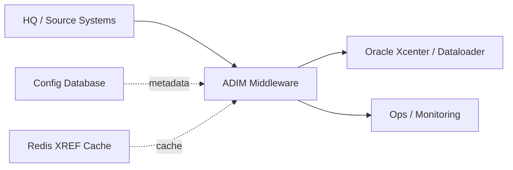

#### 15.1.2 Logical Diagram

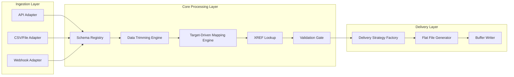

#### 15.1.3 Physical Diagram

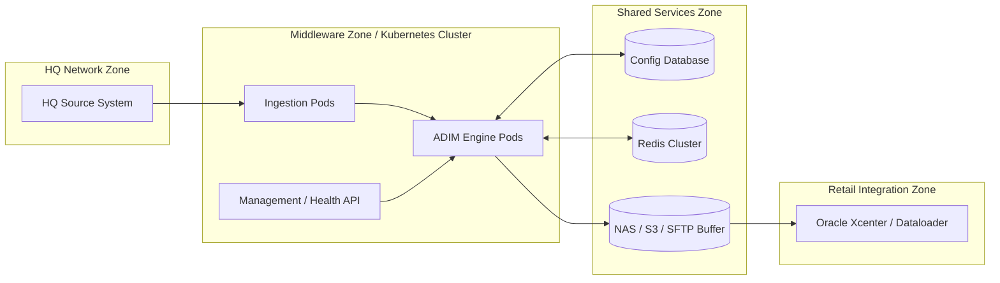

### 15.2 DFD Level 1 - Chuỗi Dữ liệu

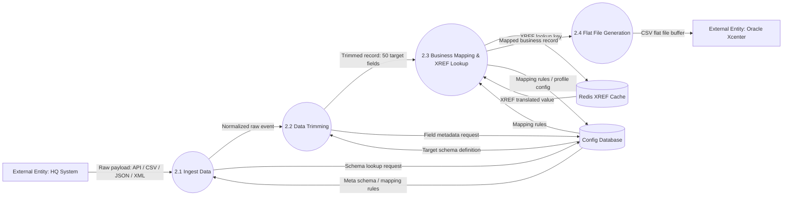

### 15.3 Sơ đồ Cơ sở Dữ liệu - ERD

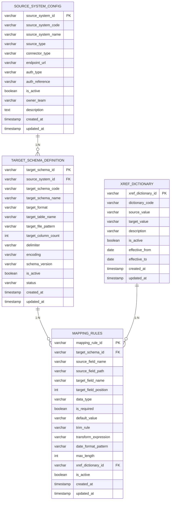

### 15.4 Sơ đồ Luồng Quy trình & Tương tác

#### 15.4.1 Lưu đồ (Flowchart)

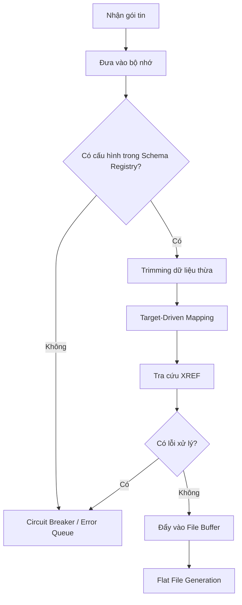

#### 15.4.2 Sơ đồ Tuần tự (Sequence Diagram)

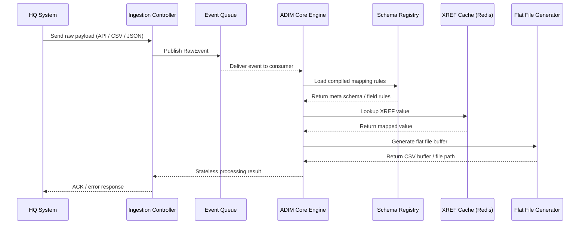

#### 15.4.3 Sơ đồ Trạng thái (State Diagram)

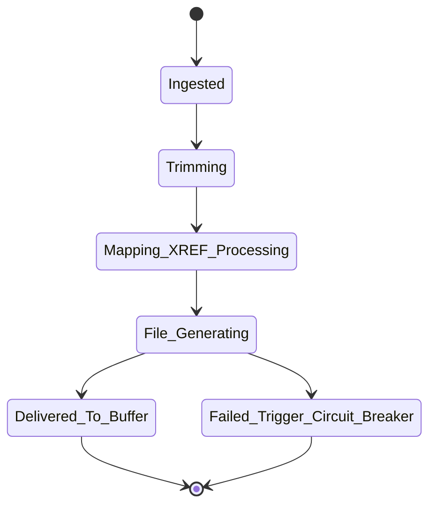

### 15.5 Sơ đồ Triển khai

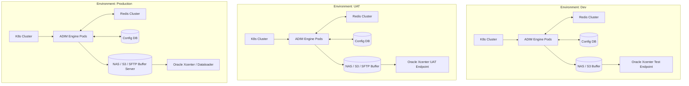

### 15.6 Sơ đồ Giao diện và Luồng người dùng (UI/UX Flow Diagram)

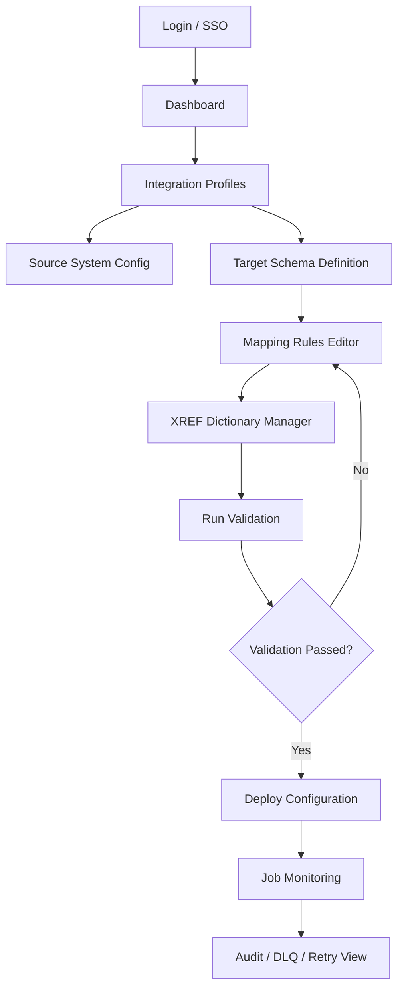

### 15.7 Ghi chú sử dụng Mermaid

- Các sơ đồ trên được viết theo định hướng copy-paste trực tiếp vào Markdown viewer có hỗ trợ Mermaid.
- Phần kiến trúc UI/UX chỉ mang tính định hướng tương lai vì hiện tại hệ thống chưa triển khai UI quản trị.
- DFD, ERD và deployment diagram được tách riêng để phục vụ cả cấp quản lý, cấp kiến trúc và cấp vận hành.

## 16. ARCHITECTURE DECISION RECORDS (ADR)

### ADR-001 - Why Event-Driven Architecture?

| Trường | Nội dung |
| --- | --- |
| Status | Accepted |
| Context | HQ, Xcenter, và nguồn đầu vào có tốc độ thay đổi cao; cần tách rời producer/consumer để giảm coupling. |
| Decision | Dùng event-driven architecture với event queue/broker làm điểm đệm trung tâm. |
| Why not synchronous REST? | REST đồng bộ làm tăng coupling, khó scale, khó retry, và không phù hợp với xử lý batch/file lớn. |
| Consequences | Cần thiết kế contract, topic strategy, idempotency, DLQ, monitoring và replay. |

### ADR-002 - Why PostgreSQL for Metadata Store?

| Trường | Nội dung |
| --- | --- |
| Status | Accepted |
| Context | Meta-schema cần transaction, join, auditability và versioning rõ ràng. |
| Decision | Dùng PostgreSQL làm configuration metadata store. |
| Why not MongoDB? | Metadata quan hệ, cần FK, versioning và audit trail rõ ràng hơn document store trong bối cảnh này. |
| Consequences | Cần migration strategy rõ ràng và schema version control. |

### ADR-003 - Why Redis Cache?

| Trường | Nội dung |
| --- | --- |
| Status | Accepted |
| Context | XREF lookup và compiled schema cần tốc độ truy xuất thấp và hỗ trợ atomic refresh. |
| Decision | Dùng Redis cho cache lookup cấp runtime, không dùng làm source of truth. |
| Why not Caffeine only? | Caffeine phù hợp single-node, nhưng ADIM cần khả năng mở rộng đa pod và cache share/rebuild theo version. |
| Consequences | Phải thiết kế cache version, TTL, warm-up và fallback khi Redis unavailable. |

### ADR-004 - Why Schema Registry Service?

| Trường | Nội dung |
| --- | --- |
| Status | Accepted |
| Context | Cấu hình schema cần versioning, rollback, cache refresh, audit và future UI. |
| Decision | Tách Schema Registry Service thành microservice riêng hoặc bounded service module. |
| Why not keep config access inside Mapping Engine? | Tách riêng giúp giảm coupling, dễ kiểm thử và dễ thay đổi contract/meta-schema. |
| Consequences | Cần API contract, caching contract và deployment/rollback riêng cho registry. |

## 17. EVENT CONTRACT SPECIFICATION

### 17.1 Canonical Event Envelope

```json
{
  "eventId": "evt-123456",
  "traceId": "trc-abcdef",
  "source": "HQ_SYSTEM",
  "profileId": "PROFILE_PRICE_01",
  "sourceType": "API_REST",
  "eventType": "RAW_RECORD",
  "schemaVersion": "v1",
  "idempotencyKey": "HQ_SYSTEM:evt-123456",
  "timestamp": "2026-06-29T10:00:00Z",
  "payload": {},
  "headers": {
    "tenant": "retail",
    "correlationId": "corr-001"
  }
}
```

### 17.2 Event Types

| Event Type | Mục đích | Producer | Consumer |
| --- | --- | --- | --- |
| `RAW_RECORD` | Dữ liệu thô đầu vào | Ingestion Controller | Core Engine |
| `MAPPED_RECORD` | Dữ liệu đã trim + map | Core Engine | Delivery Service |
| `DELIVERY_REQUESTED` | Yêu cầu ghi file/đẩy đích | Delivery Orchestrator | Writer Provider |
| `DELIVERY_COMPLETED` | Xác nhận xuất file thành công | Flat File Generator | Audit/Monitoring |
| `DLQ_EVENT` | Bản ghi lỗi cần xử lý lại | Error Handler | Reprocessor |

### 17.3 Payload Contract Rules

- `eventId` phải duy nhất trong phạm vi tenant/source system.
- `traceId` phải được truyền xuyên suốt toàn bộ luồng.
- `schemaVersion` là bắt buộc để hỗ trợ rollback và replay.
- `idempotencyKey` phải ổn định cho cùng một business record.

## 18. TOPIC & CONSUMER DESIGN

### 18.1 Topic Strategy

| Topic | Purpose | Key | Partitions | Retention | Semantics |
| --- | --- | --- | --- | --- | --- |
| `adim.raw.events` | Nhận event thô | `idempotencyKey` | 12 | 3 days | At least once |
| `adim.transformed.events` | Event đã mapping | `profileId` | 12 | 3 days | At least once |
| `adim.delivery.events` | Yêu cầu sinh file/đẩy đích | `targetSchemaId` | 6 | 7 days | At least once |
| `adim.audit.events` | Audit/monitoring stream | `traceId` | 3 | 14 days | At least once |
| `adim.dlq.events` | Poison messages | `eventId` | 6 | 14 days | At least once |

### 18.2 Consumer Group Design

- `cg-adim-ingestion`: đọc raw input theo profile.
- `cg-adim-core`: thực thi trimming, mapping, xref, validation.
- `cg-adim-delivery`: sinh file và buffer output.
- `cg-adim-audit`: ghi audit trail và metrics events.
- `cg-adim-reprocessor`: đọc DLQ để reprocess có kiểm soát.

### 18.3 Delivery Semantics

- Default target delivery semantics: **At least once**.
- Exactly once không được giả định mặc định vì file output và external sink thường không bảo đảm transactional end-to-end.
- Cần idempotency layer để triệt duplicate ở cấp ứng dụng.

## 19. IDEMPOTENCY & TRANSACTION BOUNDARY

### 19.1 Idempotency Design

| Thành phần | Thiết kế |
| --- | --- |
| Dedup key | `idempotencyKey` hoặc business key chuẩn hóa |
| Store | Redis `SETNX` cho fast check + PostgreSQL `processed_events` cho audit lâu dài |
| TTL | 24h cho Redis, lưu vĩnh viễn theo retention policy trong DB |
| Behavior | Duplicate phải bị bỏ qua an toàn, không sinh file trùng |

### 19.2 Processed Events Table

```sql
CREATE TABLE processed_events (
    processed_event_id BIGSERIAL PRIMARY KEY,
    event_id VARCHAR(100) NOT NULL,
    idempotency_key VARCHAR(150) NOT NULL,
    source_system_id VARCHAR(50) NOT NULL,
    profile_id VARCHAR(50) NOT NULL,
    status VARCHAR(30) NOT NULL,
    checksum VARCHAR(128),
    file_path VARCHAR(500),
    created_at TIMESTAMP NOT NULL DEFAULT CURRENT_TIMESTAMP,
    updated_at TIMESTAMP NOT NULL DEFAULT CURRENT_TIMESTAMP,
    UNIQUE (idempotency_key)
);
```

### 19.3 Transaction Boundary

- ADIM không nên giả định một transaction phân tán hoàn chỉnh giữa DB commit và broker publish nếu chưa có nền tảng transaction xuyên hệ thống.
- Khuyến nghị dùng **Transactional Outbox Pattern** để đảm bảo không mất event khi DB commit thành công nhưng publish thất bại.

### 19.4 Outbox Table

```sql
CREATE TABLE outbox_events (
    outbox_event_id BIGSERIAL PRIMARY KEY,
    aggregate_type VARCHAR(50) NOT NULL,
    aggregate_id VARCHAR(100) NOT NULL,
    event_type VARCHAR(50) NOT NULL,
    payload JSONB NOT NULL,
    status VARCHAR(30) NOT NULL DEFAULT 'NEW',
    retry_count INT NOT NULL DEFAULT 0,
    next_retry_at TIMESTAMP NULL,
    created_at TIMESTAMP NOT NULL DEFAULT CURRENT_TIMESTAMP,
    published_at TIMESTAMP NULL
);
```

## 20. RETRY, CIRCUIT BREAKER, VÀ STATE MACHINE MỞ RỘNG

### 20.1 Retry Strategy

| Hạng mục | Thiết kế |
| --- | --- |
| Mặc định | Exponential backoff |
| Dãy retry | 1s, 2s, 4s, sau đó dừng |
| Jitter | Có, để tránh retry storm |
| Max retry | 3 lần cho luồng sync; luồng async có thể tách policy riêng |

### 20.2 Circuit Breaker

| Trạng thái | Ý nghĩa |
| --- | --- |
| `CLOSED` | Bình thường, cho phép gọi downstream |
| `OPEN` | Chặn gọi downstream vì tỷ lệ lỗi vượt ngưỡng |
| `HALF_OPEN` | Thử lại có kiểm soát để kiểm tra phục hồi |

| Tham số | Giá trị đề xuất |
| --- | --- |
| Failure threshold | 50% trong cửa sổ 20 calls |
| Open duration | 30 giây |
| Half-open calls | 5 calls thử |

### 20.3 Message State Machine Mở Rộng

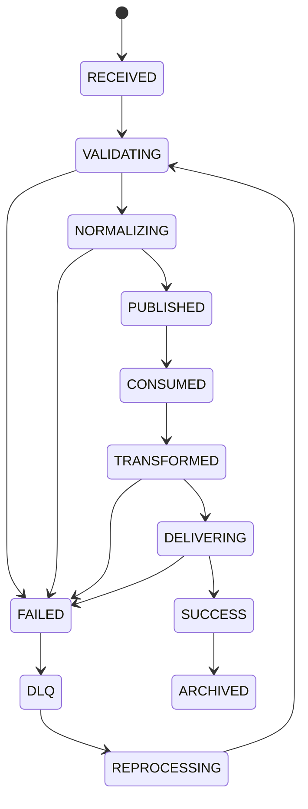

## 21. CACHE DESIGN

### 21.1 Cache Layers

| Layer | Công nghệ | Vai trò |
| --- | --- | --- |
| L1 | In-memory compiled object | Hot path lookup trong pod |
| L2 | Redis | Shared lookup cho XREF / version hints |
| L3 | PostgreSQL metadata | Source of truth cho config |

### 21.2 Cache Versioning

- Mỗi compiled schema phải có `schemaVersion` và `cacheVersion`.
- Rebuild cache phải tạo object mới, validate xong mới atomic swap.
- Không mutate cache đang phục vụ traffic.

### 21.3 Atomic Swap Design

```java
AtomicReference<CompiledSchema> activeSchema = new AtomicReference<>();

public void refresh(CompiledSchema newSchema) {
    validate(newSchema);
    activeSchema.set(newSchema);
}
```

### 21.4 Cache Warming

- Warm cache khi service start hoặc sau config update.
- Preload schema, xref dictionary, delimiter config, output format config.
- Nếu warm-up fail, giữ cache phiên bản cũ và báo cảnh báo.

## 22. SECURITY DESIGN

### 22.1 Authentication & Authorization

| Thành phần | Thiết kế |
| --- | --- |
| Authentication | OAuth2 / mTLS cho inbound; service-to-service auth cho internal calls |
| Authorization | RBAC theo role: Operator, Data Engineer, Admin, Auditor |
| JWT Claims | `sub`, `tenant`, `roles`, `scope`, `traceId` |

### 22.2 Permission Matrix

| Chức năng | Operator | Data Engineer | Admin | Auditor |
| --- | --- | --- | --- | --- |
| View cache status | Yes | Yes | Yes | Yes |
| Reload schema | No | Yes | Yes | No |
| Edit mapping | No | Yes | Yes | No |
| View DLQ | No | Yes | Yes | Yes |
| Reprocess message | No | Yes | Yes | No |

### 22.3 Data Protection

- Encryption in transit: TLS 1.2+.
- Encryption at rest: disk encryption / managed storage encryption.
- Secret management: Vault hoặc Kubernetes Secret với rotation policy.
- Audit security events: login, schema update, mapping update, DLQ replay, manual override.

## 23. FAILURE RECOVERY DESIGN

### 23.1 Failure Scenarios

| Scenario | Detection | Behavior |
| --- | --- | --- |
| Kafka Down | broker unavailable | Buffer/hold publisher, open circuit breaker, alert |
| DB Down | connection timeout | Use last known cache, reject config refresh, alert |
| Redis Down | cache miss fallback | Use L1 cache, degrade xref lookups, alert |
| Disk Full | write failure | Stop delivery, send DLQ/alert, preserve raw event |
| Network Partition | health check failure | Retry with backoff, no assumption of success |
| Poison Message | repeated validation fail | Send to DLQ with reason and checksum |
| Duplicate Message | idempotency hit | Skip processing safely |
| Schema Drift | version mismatch | Reject/flag, notify operator, optional compat mode |

### 23.2 Reprocessing Design

- DLQ message phải giữ raw payload, reason, stack trace summary, schema version, retry count.
- Reprocess chỉ được thực hiện sau khi operator xác nhận fix mapping/schema.
- Reprocess phải tạo `traceId` mới nhưng giữ `originEventId` để audit.

## 24. CAPACITY PLANNING

### 24.1 Target Sizing Assumptions

| Chỉ tiêu | Giá trị giả định |
| --- | --- |
| Peak throughput | 10.000 msg/s |
| Average payload size | 2 KB |
| Burst window | 15 phút |
| Target P95 latency | < 500 ms |

### 24.2 Initial Capacity Recommendation

| Thành phần | Ước lượng ban đầu |
| --- | --- |
| ADIM Pods | 3 replicas minimum, HPA up to 10+ |
| CPU per pod | 2 vCPU baseline |
| RAM per pod | 4 GB baseline |
| Redis | 1 primary + 1 replica (hoặc cluster mode tùy tải) |
| PostgreSQL | 2 vCPU / 4 GB baseline, tách storage phù hợp |
| Kafka partitions | 12 cho raw/transformed, 6 cho delivery/audit tùy topic |

### 24.3 Scaling Notes

- Horizontal scaling dựa vào stateless core.
- Tăng partitions nếu consumer lag cao.
- Cần benchmark thực tế trước khi chốt sizing cuối cùng.

## 25. DEPLOYMENT STRATEGY

### 25.1 Strategy Matrix

| Strategy | Khi dùng | Rủi ro |
| --- | --- | --- |
| Rolling Update | thay đổi nhỏ, ít rủi ro | có thể có mixed version trong rollout |
| Blue/Green | cần rollback nhanh | tốn tài nguyên gấp đôi trong rollout |
| Canary | schema/refactor có rủi ro | cần routing/control tốt |

### 25.2 Release Rules

- Config change đi qua versioning và approval.
- Schema migration phải đi trước code dùng schema mới nếu thay đổi breaking.
- Feature flag dùng cho rollout bảng/connector mới.
- Rollback phải bao gồm code, config và schema version tương thích.

### 25.3 Schema Migration Tooling

- Khuyến nghị dùng Flyway hoặc Liquibase cho metadata schema.
- Không deploy breaking schema và code không tương thích trong cùng một release nếu chưa có compatibility layer.

## 26. DATABASE EXTENSION

### 26.1 Bổ sung bảng vận hành

```sql
CREATE TABLE audit_logs (
    audit_log_id BIGSERIAL PRIMARY KEY,
    trace_id VARCHAR(100) NOT NULL,
    event_id VARCHAR(100) NOT NULL,
    action VARCHAR(100) NOT NULL,
    status VARCHAR(30) NOT NULL,
    message TEXT,
    created_at TIMESTAMP NOT NULL DEFAULT CURRENT_TIMESTAMP
);

CREATE TABLE dead_letter_queue (
    dlq_id BIGSERIAL PRIMARY KEY,
    event_id VARCHAR(100) NOT NULL,
    trace_id VARCHAR(100),
    profile_id VARCHAR(50),
    source_system_id VARCHAR(50),
    error_code VARCHAR(50),
    error_message TEXT,
    payload JSONB NOT NULL,
    retry_count INT NOT NULL DEFAULT 0,
    schema_version VARCHAR(50),
    created_at TIMESTAMP NOT NULL DEFAULT CURRENT_TIMESTAMP
);

CREATE TABLE schema_versions (
    schema_version_id BIGSERIAL PRIMARY KEY,
    profile_id VARCHAR(50) NOT NULL,
    schema_version VARCHAR(50) NOT NULL,
    checksum VARCHAR(128) NOT NULL,
    status VARCHAR(30) NOT NULL,
    created_at TIMESTAMP NOT NULL DEFAULT CURRENT_TIMESTAMP,
    activated_at TIMESTAMP NULL
);

CREATE TABLE integration_jobs (
    integration_job_id BIGSERIAL PRIMARY KEY,
    profile_id VARCHAR(50) NOT NULL,
    job_type VARCHAR(50) NOT NULL,
    status VARCHAR(30) NOT NULL,
    started_at TIMESTAMP,
    completed_at TIMESTAMP,
    created_at TIMESTAMP NOT NULL DEFAULT CURRENT_TIMESTAMP
);

CREATE TABLE reprocessing_history (
    reprocessing_history_id BIGSERIAL PRIMARY KEY,
    dlq_id BIGINT NOT NULL,
    old_event_id VARCHAR(100) NOT NULL,
    new_event_id VARCHAR(100) NOT NULL,
    result_status VARCHAR(30) NOT NULL,
    created_at TIMESTAMP NOT NULL DEFAULT CURRENT_TIMESTAMP
);

CREATE INDEX idx_dlq_event_id ON dead_letter_queue(event_id);
CREATE INDEX idx_audit_trace_id ON audit_logs(trace_id);
CREATE INDEX idx_schema_versions_profile ON schema_versions(profile_id, schema_version);
```

## 27. OPERATIONAL RUNBOOK

### 27.1 Startup Checklist

1. Verify PostgreSQL connectivity.
2. Verify Redis availability and cache namespace.
3. Verify topic connectivity and consumer group assignment.
4. Verify schema version activation.
5. Verify health endpoints and metrics scrape.

### 27.2 Cache Reload Runbook

1. Update metadata in DB.
2. Trigger schema validation.
3. Rebuild compiled cache in background.
4. Perform atomic swap only if validation passes.
5. Record audit and metric events.

### 27.3 DLQ Handling Runbook

1. Inspect `error_code`, `error_message`, and payload checksum.
2. Classify issue: data, schema, downstream, or infrastructure.
3. Fix root cause.
4. Reprocess with controlled replay window.
5. Track result in reprocessing history.

### 27.4 Incident Response Runbook

| Incident | First action |
| --- | --- |
| Kafka down | Open circuit breaker and alert on-call |
| DB down | Freeze config refresh, use last known cache |
| Redis down | Fall back to local cache and alert |
| Disk full | Stop file generation, protect raw events |
| Poison message storm | Quarantine to DLQ and pause replay |

## 28. BỔ SUNG KHUYẾN NGHỊ VỀ SƠ ĐỒ HỆ THỐNG

- Nên cập nhật sơ đồ logical để thể hiện rõ `Schema Registry Service` là một bounded service riêng giữa Config DB và Mapping Engine.
- Nên bổ sung một sequence diagram riêng cho transactional outbox + publish + reprocess + audit để phản ánh đúng hành vi production.
- Nên thêm deployment note cho blue/green hoặc canary nếu release liên quan đến schema breaking change.

## 29. PRODUCTION DATA MODEL EXTENSION

### 29.1 Các bảng cần có cho production

```sql
CREATE TABLE job_execution (
    job_id BIGSERIAL PRIMARY KEY,
    profile_id VARCHAR(50) NOT NULL,
    status VARCHAR(30) NOT NULL,
    total_records BIGINT NOT NULL DEFAULT 0,
    success_records BIGINT NOT NULL DEFAULT 0,
    failed_records BIGINT NOT NULL DEFAULT 0,
    started_at TIMESTAMP NOT NULL DEFAULT CURRENT_TIMESTAMP,
    completed_at TIMESTAMP NULL
);

CREATE TABLE file_generation_history (
    file_id BIGSERIAL PRIMARY KEY,
    profile_id VARCHAR(50) NOT NULL,
    file_name VARCHAR(255) NOT NULL,
    row_count BIGINT NOT NULL,
    checksum VARCHAR(128) NOT NULL,
    generated_at TIMESTAMP NOT NULL DEFAULT CURRENT_TIMESTAMP,
    archive_path VARCHAR(500),
    delivery_status VARCHAR(30) NOT NULL DEFAULT 'GENERATED'
);

CREATE TABLE schema_versions (
    schema_version_id BIGSERIAL PRIMARY KEY,
    profile_id VARCHAR(50) NOT NULL,
    version_no INT NOT NULL,
    effective_from TIMESTAMP NOT NULL,
    effective_to TIMESTAMP NULL,
    is_current BOOLEAN NOT NULL DEFAULT FALSE,
    status VARCHAR(30) NOT NULL,
    checksum VARCHAR(128) NOT NULL,
    created_by VARCHAR(100) NOT NULL,
    created_at TIMESTAMP NOT NULL DEFAULT CURRENT_TIMESTAMP
);

CREATE TABLE field_mapping_versions (
    field_mapping_version_id BIGSERIAL PRIMARY KEY,
    target_schema_id VARCHAR(50) NOT NULL,
    version_no INT NOT NULL,
    effective_from TIMESTAMP NOT NULL,
    effective_to TIMESTAMP NULL,
    is_current BOOLEAN NOT NULL DEFAULT FALSE,
    status VARCHAR(30) NOT NULL,
    created_by VARCHAR(100) NOT NULL,
    created_at TIMESTAMP NOT NULL DEFAULT CURRENT_TIMESTAMP
);

CREATE TABLE config_history (
    config_history_id BIGSERIAL PRIMARY KEY,
    entity_type VARCHAR(50) NOT NULL,
    entity_id VARCHAR(100) NOT NULL,
    old_status VARCHAR(30),
    new_status VARCHAR(30) NOT NULL,
    action VARCHAR(50) NOT NULL,
    actor VARCHAR(100) NOT NULL,
    comment TEXT,
    created_at TIMESTAMP NOT NULL DEFAULT CURRENT_TIMESTAMP
);

CREATE INDEX idx_job_execution_profile ON job_execution(profile_id, status);
CREATE INDEX idx_file_generation_profile ON file_generation_history(profile_id, generated_at);
CREATE INDEX idx_schema_versions_current ON schema_versions(profile_id, is_current);
CREATE INDEX idx_field_mapping_versions_current ON field_mapping_versions(target_schema_id, is_current);
```

### 29.2 Production operating rules

- Không cập nhật trực tiếp cấu hình production bằng `ACTIVE` đơn lẻ.
- Mọi thay đổi phải đi qua version, effective date, approval và audit trail.
- `is_current` chỉ được đổi bằng logic atomic swap sau khi bản mới đã validate.

## 30. VERSIONING & CONFIG HISTORY

### 30.1 Version lifecycle

| Trạng thái | Ý nghĩa |
| --- | --- |
| `DRAFT` | Cấu hình đang soạn thảo |
| `PENDING_APPROVAL` | Chờ duyệt |
| `APPROVED` | Đã được duyệt |
| `REJECTED` | Bị từ chối |
| `DEPLOYED` | Đã triển khai |
| `ROLLED_BACK` | Đã rollback |

### 30.2 Versioning policy

- Mỗi thay đổi mapping phải tạo version mới.
- Version cũ vẫn phải tồn tại để rollback và replay.
- `effective_from` và `effective_to` phải rõ ràng để truy vết dữ liệu theo thời điểm.

### 30.3 Change history rules

- Mọi trạng thái config phải được ghi vào `config_history`.
- Không cho phép xóa cứng config trong production nếu chưa archive.

## 31. WORKFLOW APPROVAL & MAKER-CHECKER

### 31.1 Approval flow

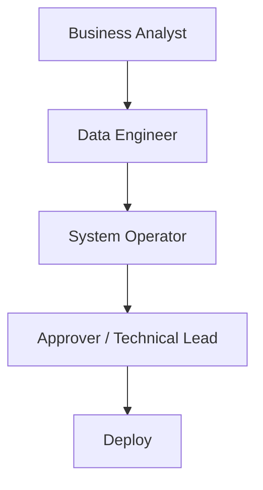

### 31.2 Approval rules

| Step | Actor | Responsibility |
| --- | --- | --- |
| Maker | Business Analyst | Tạo/điều chỉnh mapping, schema, XREF |
| Checker | Data Engineer | Kiểm tra logic, completeness, compatibility |
| Operator | System Operator | Kiểm tra runtime impact, schedule deploy |
| Approver | Technical Lead / Owner | Phê duyệt cuối |

### 31.3 Workflow states

| State | Meaning |
| --- | --- |
| `NEW` | Bản nháp mới tạo |
| `IN_REVIEW` | Đang review |
| `APPROVED` | Đã duyệt |
| `DEPLOYED` | Đã deploy |
| `ROLLED_BACK` | Đã rollback |

## 32. RBAC DESIGN

### 32.1 Security model

```sql
CREATE TABLE users (
    user_id BIGSERIAL PRIMARY KEY,
    username VARCHAR(100) NOT NULL UNIQUE,
    full_name VARCHAR(150) NOT NULL,
    email VARCHAR(150) NOT NULL UNIQUE,
    is_active BOOLEAN NOT NULL DEFAULT TRUE,
    created_at TIMESTAMP NOT NULL DEFAULT CURRENT_TIMESTAMP
);

CREATE TABLE roles (
    role_id BIGSERIAL PRIMARY KEY,
    role_code VARCHAR(50) NOT NULL UNIQUE,
    role_name VARCHAR(100) NOT NULL,
    description TEXT,
    created_at TIMESTAMP NOT NULL DEFAULT CURRENT_TIMESTAMP
);

CREATE TABLE permissions (
    permission_id BIGSERIAL PRIMARY KEY,
    permission_code VARCHAR(100) NOT NULL UNIQUE,
    permission_name VARCHAR(150) NOT NULL,
    description TEXT,
    created_at TIMESTAMP NOT NULL DEFAULT CURRENT_TIMESTAMP
);

CREATE TABLE user_roles (
    user_role_id BIGSERIAL PRIMARY KEY,
    user_id BIGINT NOT NULL,
    role_id BIGINT NOT NULL,
    created_at TIMESTAMP NOT NULL DEFAULT CURRENT_TIMESTAMP
);

CREATE TABLE role_permissions (
    role_permission_id BIGSERIAL PRIMARY KEY,
    role_id BIGINT NOT NULL,
    permission_id BIGINT NOT NULL,
    created_at TIMESTAMP NOT NULL DEFAULT CURRENT_TIMESTAMP
);
```

### 32.2 Roles

- Business Analyst.
- Data Engineer.
- System Operator.
- Auditor.
- Admin.

## 33. SECURITY DESIGN

### 33.1 API gateway controls

| Control | Mục đích |
| --- | --- |
| Rate limit | Ngăn abuse và traffic spike |
| JWT validation | Xác thực request từ client hoặc hệ thống khác |
| API key | Hỗ trợ integration legacy |
| mTLS | Xác thực service-to-service |
| WAF | Chặn tấn công phổ biến |

### 33.2 Secret management

| Secret source | Use case |
| --- | --- |
| Vault | Khuyến nghị cho secret rotation và policy |
| Kubernetes Secret | Dùng cho runtime secret nhẹ hơn |
| AWS Secret Manager | Dùng khi deploy trên AWS-managed environment |

### 33.3 Encryption & masking

- Encryption at rest: AES-256.
- In transit: TLS 1.3 ưu tiên, TLS 1.2 khi môi trường chưa hỗ trợ.
- PII masking phải áp dụng cho các trường như `customer_email`, `phone`, `national_id` trước khi ghi log/audit nếu policy yêu cầu.

## 34. OBSERVABILITY DESIGN

### 34.1 Tracing and logging

| Signal | Thiết kế |
| --- | --- |
| Trace ID | Xuyên suốt toàn bộ request/message |
| Span ID | Cho từng hop xử lý |
| Correlation ID | Liên kết business request với audit trail |
| Logging format | JSON structured log |
| Tracing stack | OpenTelemetry + Jaeger |

### 34.2 Log schema

```json
{
  "traceId": "",
  "spanId": "",
  "correlationId": "",
  "eventId": "",
  "profileId": "",
  "sourceTable": "",
  "status": "",
  "message": ""
}
```

### 34.3 Monitoring set

- Prometheus metrics cho throughput, latency, error rate, DLQ count, cache hit ratio.
- Grafana dashboard cho runtime health, consumer lag, file generation, retry rate.
- Loki cho log aggregation.

## 35. KAFKA DESIGN

### 35.1 Topic naming standard

- `adim.raw.events`
- `adim.transformed.events`
- `adim.delivery.events`
- `adim.audit.events`
- `adim.dlq.events`

### 35.2 Partition and retention

| Topic | Partitions | Replication factor | Retention |
| --- | --- | --- | --- |
| raw | 12 | 3 | 7 days |
| transformed | 12 | 3 | 7 days |
| delivery | 6 | 3 | 30 days |
| audit | 3 | 3 | 30 days |
| dlq | 6 | 3 | 30 days |

### 35.3 Consumer design

- Consumer group cho mapping engine: `mapping-engine-group`.
- Consumer group cho delivery: `delivery-group`.
- Consumer group cho reprocess: `dlq-reprocess-group`.

### 35.4 Ordering and idempotency

- Partition key nên là `source_table` hoặc `business_key` tùy yêu cầu ordering.
- Dùng `event_id` + `dedup_key` để chống duplicate.
- Kafka transaction chỉ nên ghi là tùy chọn khi toàn bộ stack hỗ trợ và đã benchmark rõ.

## 36. CACHE DESIGN

### 36.1 Cache capabilities

- Cache invalidation theo version.
- Cache warmup khi start/reload.
- Cache snapshot để rollback nhanh.
- Cache rebuild strategy theo atomic swap.
- Cache consistency dựa trên `schema_version` và `cache_version`.

### 36.2 Cache consistency table

| Event | Action |
| --- | --- |
| Config approved | rebuild new cache |
| Config deployed | swap atomic reference |
| Config rolled back | restore previous snapshot |
| DB unavailable | keep existing cache |

## 37. HA/DR DESIGN

### 37.1 Platform layout

| Component | HA design |
| --- | --- |
| PostgreSQL | Primary + replica + automatic failover |
| Kafka | 3 brokers minimum |
| Redis | Sentinel hoặc cluster mode |
| File storage | Shared NAS / S3 / SFTP buffer with retention |

### 37.2 Backup and DR

- Backup hàng ngày cho metadata DB.
- Backup log/archive theo retention policy.
- DR tối thiểu cross-region cho production quan trọng.
- RTO/RPO phải được kiểm thử định kỳ, không chỉ ghi trên giấy.

## 38. FILE DELIVERY DESIGN

### 38.1 File controls

| Control | Description |
| --- | --- |
| Checksum | Dùng SHA-256 hoặc checksum chuẩn nội bộ để verify file integrity |
| Duplicate file detection | Không sinh file trùng cùng checksum + profile + time window |
| Retry upload | Retry có backoff khi upload/sync buffer thất bại |
| Archive policy | Lưu bản sao file sau khi deliver |
| Retention policy | Xóa/archived theo quy định nghiệp vụ |
| Naming standard | `profile_table_yyyyMMdd_HHmmss_seq.csv` |
| Partial recovery | Cho phép regenerate file từ job execution hoặc outbox replay |

### 38.2 File generation history usage

- Mỗi file sinh ra phải được ghi vào `file_generation_history`.
- File checksum phải đồng bộ với job execution và audit record.

## 39. PERFORMANCE DESIGN & CAPACITY PLAN

### 39.1 Sizing assumptions

| Item | Value |
| --- | --- |
| Peak TPS | 10,000 |
| Average TPS | 2,000 |
| Message size | 2 KB |
| Daily volume | 100M messages |
| Storage/year | 12 TB (ước lượng tùy retention) |

### 39.2 Pod sizing recommendation

| Tầng | CPU | RAM | Notes |
| --- | --- | --- | --- |
| Ingestion | 1-2 vCPU | 2-4 GB | phụ thuộc connector |
| Core engine | 2 vCPU | 4-8 GB | hot path xử lý mapping |
| Delivery | 1-2 vCPU | 2-4 GB | file I/O, upload buffer |

### 39.3 Benchmark rules

- Benchmark phải ghi rõ payload size, row count, batch size, partitions và số pod.
- Không dùng TPS trừu tượng nếu chưa có môi trường benchmark lặp lại.

## 40. DEPLOYMENT STRATEGY

### 40.1 Strategy matrix

| Strategy | Use case |
| --- | --- |
| Rolling update | thay đổi nhỏ, backward compatible |
| Blue/Green | release quan trọng, cần rollback nhanh |
| Canary | schema or logic change có rủi ro |

### 40.2 Rollback rules

- Rollback phải gồm code, config, cache, schema version nếu cần.
- Không rollback một nửa khi versioning không tương thích.

### 40.3 Deployment sequence

1. Deploy DB migration.
2. Deploy schema registry service/config.
3. Warm cache.
4. Deploy core engine.
5. Deploy delivery.
6. Observe metrics and rollback if needed.

## 41. ERROR MODEL

### 41.1 Shared error codes

| Error code | Meaning | Action |
| --- | --- | --- |
| `ERR001` | Missing required field | DLQ |
| `ERR002` | Invalid data type | DLQ |
| `ERR003` | XREF not found | Default value / warning |
| `ERR004` | Target unavailable | Retry |
| `ERR005` | Kafka unavailable | Circuit breaker |
| `ERR006` | Database down | Retry / keep cache |
| `ERR007` | Duplicate event | Skip |
| `ERR008` | Schema version mismatch | Reject / notify |

### 41.2 Error handling guidance

- Không trả `null` cho lỗi convert nếu lỗi đó là business-critical; phải raise typed exception hoặc map vào error code.
- Mọi lỗi production phải đi qua error model thống nhất để audit, DLQ và dashboard dùng chung.

## 42. BỔ SUNG VỀ UML CẦN CÓ CHO PRODUCTION

- Deployment sequence diagram.
- Cache reload sequence diagram.
- Retry sequence diagram.
- DLQ processing sequence diagram.
- Authentication sequence diagram.
- Approval workflow sequence diagram.
- Config deployment sequence diagram.

## 43. KẾT LUẬN VỀ PRODUCTION READINESS

- Với các bổ sung ở trên, tài liệu đã bao phủ phần lớn khoảng trống production mà review nêu ra.
- Điểm còn lại để đạt mức production thật sự là chuyển các thiết kế này thành code, migration scripts, integration contracts và runbooks có thể chạy được.
- Nếu muốn, bước tiếp theo nên là chốt riêng một bản “Production Readiness Appendix” hoặc bắt đầu refactor codebase theo các bảng/contract vừa bổ sung.

## 44. NON FUNCTIONAL DESIGN CHI TIẾT

### 44.1 Performance envelope

| Metric | Target |
| --- | --- |
| Peak TPS | 10,000 msg/s |
| Average TPS | 2,000 msg/s |
| Average payload | 20 KB |
| Peak payload | 2 MB |
| P95 latency | < 500 ms |
| Processing time per record | < 5 ms trong hot path |
| Error rate | < 1% bình quân, cảnh báo khi > 2% trong 5 phút |

### 44.2 Resource profile

| Resource | Value |
| --- | --- |
| CPU | 4 vCPU baseline cho core processing node |
| Memory | 8 GB baseline cho core processing node |
| Pods | 3 replicas minimum |
| HPA | min 3, max 10 |
| Kafka throughput | đủ cho peak raw + transformed traffic |
| Connection pool | 10-30 tùy runtime profile |
| DB connections | giới hạn theo pool và consumer concurrency |
| Thread pool | tách ingestion, mapping, delivery, audit |

### 44.3 IO and runtime metrics

| Metric | Mục tiêu |
| --- | --- |
| Disk I/O | không chặn hot path; file buffer phải async khi có thể |
| Kafka throughput | không thấp hơn peak consumer lag tolerance |
| Consumer lag | phải nằm trong ngưỡng cảnh báo |
| DB connection utilization | dưới ngưỡng saturation |
| Cache hit ratio | cao, dùng để giảm round-trip DB |

## 45. CAPACITY PLANNING

| Metric | Value |
| --- | --- |
| Peak Event | 10M/day |
| Peak TPS | 10k/s |
| Avg Payload | 20 KB |
| Peak Payload | 2 MB |
| Kafka Partition | 12 |
| Consumer Group | 6 |
| Retention | 7 days |

### 45.1 Capacity rationale

- 3 pods là baseline để bảo đảm HA khi 1 pod fail và vẫn còn đủ quorum xử lý traffic bình thường.
- 8 GB RAM là mức khởi điểm để giữ compiled schema, xref cache, object buffer và thread overhead mà không đẩy GC lên quá cao.
- 3 Kafka broker là cấu hình tối thiểu thực tế cho replication factor 3 và khả năng chịu lỗi 1 broker.

### 45.2 Sizing note

- Capacity phải được hiệu chỉnh bằng benchmark thực tế theo payload size, partition count, consumer concurrency và file generation rate.
- Khi payload tăng tới 2 MB, cần chunking/streaming để tránh spike memory.

## 46. DATABASE DESIGN BỔ SUNG

### 46.1 Common columns and constraints

Mọi bảng production nên có:

- `created_by`
- `created_at`
- `updated_by`
- `updated_at`
- `version`
- `status`

### 46.2 Indexing and integrity

| Design item | Requirement |
| --- | --- |
| Primary key | surrogate key hoặc business key có kiểm soát |
| Unique key | bảo vệ duplicate config, duplicate event, duplicate file |
| FK constraint | giữ toàn vẹn giữa profile, schema, mapping, DLQ, job |
| Optimistic lock | dùng `version` để tránh update race condition |
| Audit columns | ghi lịch sử thay đổi |

### 46.3 Production tables recap

- `audit_logs`
- `dead_letter_queue`
- `job_execution`
- `file_generation_history`
- `schema_versions`
- `field_mapping_versions`
- `config_history`
- `processed_events`
- `outbox_events`

## 47. MIGRATION STRATEGY

### 47.1 Schema change policy

| Tool | Purpose |
| --- | --- |
| Flyway | versioned migration for controlled rollout |
| Liquibase | alternative if declarative changelog is preferred |
| Backward compatibility | required before deploy |
| Rollback script | required for every breaking migration |

### 47.2 Migration rules

- Không deploy code phụ thuộc schema mới trước khi schema tương thích đã sẵn sàng.
- Mọi migration phải có forward path và rollback path.
- Breaking change phải đi qua approval workflow và canary/blue-green if needed.

## 48. API CONTRACT

### 48.1 Ingestion API

```http
POST /ingestion
Content-Type: application/json
```

#### Request

```json
{
    "eventId": "evt-123456",
    "traceId": "trc-abcdef",
    "profileId": "PROFILE_PRICE_01",
    "sourceSystemId": "HQ_SYSTEM",
    "sourceType": "API_REST",
    "eventType": "RAW_RECORD",
    "timestamp": "2026-06-29T10:00:00Z",
    "payload": {
        "Item_Code": "A001",
        "Base_Price": 10000
    }
}
```

#### Response success

```json
{
    "status": "SUCCESS",
    "eventId": "evt-123456",
    "jobId": "job-9001",
    "message": "Accepted for processing"
}
```

#### Error response

```json
{
    "status": "FAILED",
    "errorCode": "ERR001",
    "message": "Missing required field: Item_Code",
    "traceId": "trc-abcdef"
}
```

## 49. EVENT CONTRACT & SCHEMA REGISTRY

### 49.1 Canonical schema rules

- Event contract phải có `eventId`, `eventType`, `source`, `timestamp`, `schemaVersion`, `payload`.
- Mỗi event phải mang version để hỗ trợ compatibility.
- Event schema phải được quản trị bởi Schema Registry Service.

### 49.2 Avro / compatibility notes

- Nếu dùng Kafka, Avro hoặc Protobuf là lựa chọn phù hợp hơn JSON thuần cho contract nghiêm ngặt.
- Compatibility policy nên là backward compatible cho schema evolution an toàn.

### 49.3 Example event envelope

```json
{
    "eventId": "evt-123456",
    "eventType": "RAW_RECORD",
    "source": "HQ_SYSTEM",
    "timestamp": "2026-06-29T10:00:00Z",
    "schemaVersion": "v1",
    "payload": {}
}
```

## 50. IDEMPOTENCY DESIGN

### 50.1 Duplicate handling

- Nếu Kafka deliver duplicate, consumer phải kiểm tra `idempotencyKey` trước khi xử lý.
- Nếu consumer restart, event đã xử lý không được generate file trùng.
- Target delivery mặc định là **at least once**, nhưng application phải đảm bảo duplicate-safe.

### 50.2 Idempotency store

| Store | Purpose |
| --- | --- |
| Redis SETNX | fast path dedup |
| PostgreSQL processed_events | durable dedup/audit |

## 51. RETRY DESIGN

### 51.1 Retry topology

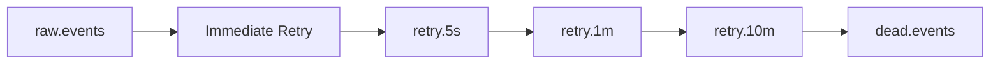

### 51.2 Retry policy

| Policy | Value |
| --- | --- |
| Immediate retry | 1 lần |
| Backoff | exponential with jitter |
| Retry topics | 5s, 1m, 10m |
| DLQ | final destination after retry budget exhausted |

## 52. KAFKA DESIGN BỔ SUNG

### 52.1 Partitioning and ordering

| Concern | Design |
| --- | --- |
| Partition key | `source_table` hoặc `business_key` |
| Ordering | preserved within partition only |
| Replication factor | 3 |
| Offset commit | after successful processing stage |
| Ack strategy | manual ack / controlled commit |
| Compression | snappy hoặc lz4 nếu payload lớn |

### 52.2 Consumer lag and rebalance

- Consumer lag phải được theo dõi ở level topic và group.
- Rebalance nên giảm bằng partition hợp lý và consumer concurrency ổn định.
- Idempotent consumer là bắt buộc do at least once delivery.

## 53. TRANSACTION BOUNDARY & OUTBOX PATTERN

### 53.1 Transaction boundary

- Save audit / config / job state không nên tách rời publish event nếu chưa có outbox.
- Nếu DB commit success nhưng publish fail, outbox sẽ giữ event để publish lại.

### 53.2 Outbox flow

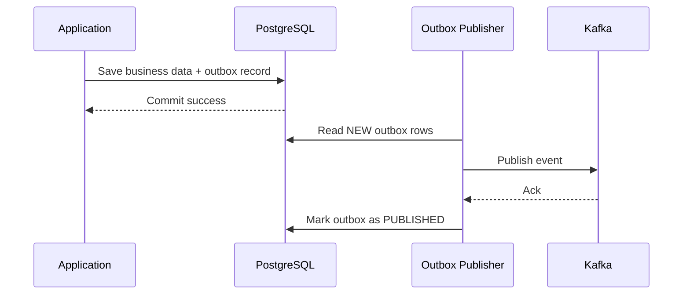

## 54. OBSERVABILITY DESIGN BỔ SUNG

### 54.1 Metrics

| Metric | Meaning |
| --- | --- |
| `processing_time` | thời gian xử lý event |
| `error_rate` | tỷ lệ lỗi |
| `consumer_lag` | độ trễ consume |
| `retry_count` | số lần retry |
| `dlq_size` | size DLQ |
| `cache_size` | số rule/compiled schema trong cache |

### 54.2 Structured log example

```json
{
    "traceId": "",
    "spanId": "",
    "correlationId": "",
    "eventId": "",
    "profileId": "",
    "status": "",
    "errorCode": ""
}
```

### 54.3 Tracing stack

- OpenTelemetry.
- Jaeger hoặc Zipkin.

## 55. SECURITY DESIGN BỔ SUNG

### 55.1 Authentication

- OAuth2 cho người dùng và client integration.
- JWT cho service/API authentication.
- mTLS cho service-to-service traffic quan trọng.

### 55.2 Authorization

- RBAC là mặc định.
- ABAC có thể dùng cho tenant, environment, profile scope nếu cần chi tiết hơn.

### 55.3 Secret management and encryption

- Vault hoặc Kubernetes Secret cho runtime secrets.
- At rest encryption bắt buộc.
- In transit encryption bắt buộc.

### 55.4 PII and audit

- PII masking phải áp dụng ở log/audit/export khi data policy yêu cầu.
- Audit log phải bất biến hoặc khó sửa dấu vết, có checksum nếu cần.

## 56. DR & BACKUP STRATEGY

### 56.1 Disaster scenarios

| Scenario | Response |
| --- | --- |
| DB down | fallback to cache, freeze config refresh |
| Kafka down | open circuit breaker, buffer/reject controlled |
| Region down | failover to secondary region if configured |

### 56.2 Backup strategy

| Item | Policy |
| --- | --- |
| DB backup | daily full + incremental if needed |
| Restore test | định kỳ, không chỉ backup mà phải test restore |
| RPO | dưới 5 phút theo mục tiêu |
| RTO | dưới 30 phút theo mục tiêu |

## 57. DEPLOYMENT STRATEGY BỔ SUNG

### 57.1 Strategy options

| Strategy | Use |
| --- | --- |
| Blue/Green | rollback nhanh |
| Canary | validate release nhỏ trước |
| Rolling Update | change nhẹ, backward compatible |
| Feature Toggle | bật/tắt theo profile/table |

### 57.2 Release sequence

1. Deploy migration.
2. Deploy schema registry/config.
3. Warm cache.
4. Deploy app.
5. Observe metrics.
6. Rollback if threshold violated.

## 58. STATE MACHINE BỔ SUNG

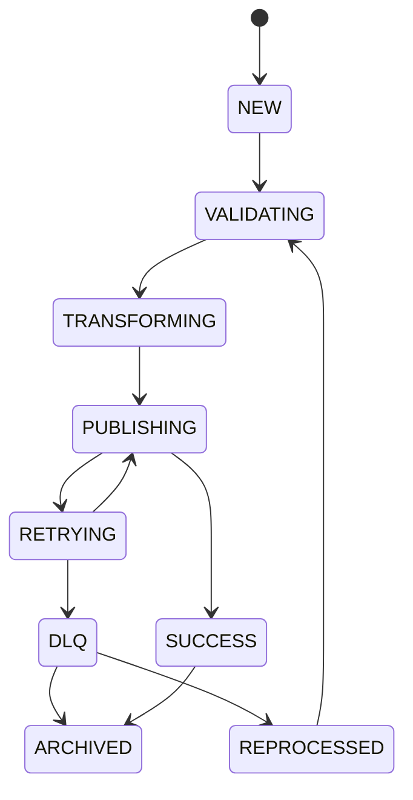

## 59. ADR APPENDIX

### ADR-001 - Why Kafka?

| Field | Content |
| --- | --- |
| Decision | Kafka for event backbone |
| Reason | decouple producer/consumer, replay, scale |

### ADR-002 - Why PostgreSQL?

| Field | Content |
| --- | --- |
| Decision | PostgreSQL for metadata and operational audit |
| Reason | relational integrity, auditability, schema governance |

### ADR-003 - Why Redis?

| Field | Content |
| --- | --- |
| Decision | Redis for fast runtime lookup |
| Reason | low latency, TTL, atomic primitives |

### ADR-004 - Why Kubernetes?

| Field | Content |
| --- | --- |
| Decision | Kubernetes for stateless horizontal scaling |
| Reason | HPA, rolling/blue-green/canary deployment |

### ADR-005 - Why Target-Driven Mapping?

| Field | Content |
| --- | --- |
| Decision | target-driven mapping as core processing model |
| Reason | trim noise, preserve only required destination fields |

## 60. RISK ASSESSMENT

| Risk | Impact | Mitigation |
| --- | --- | --- |
| Kafka Down | High | retry, circuit breaker, alert |
| DB Down | High | keep cache, freeze refresh |
| Cache Corruption | High | snapshot, atomic swap, rollback |
| Huge File | Medium | chunking/streaming |
| Bad Mapping | High | validation, approval, test gates |
| Schema Drift | High | versioning, compatibility rules |

## 61. FINAL ENTERPRISE NOTE

- Production readiness không chỉ là có tính năng, mà là có contract, governance, rollback, observability, resiliency, security và runbook.
- Nếu muốn, tài liệu có thể tiếp tục được tách thành các phụ lục riêng: NFR, Capacity, Security, Kafka, DR, ADR và Runbook để dễ review bởi team enterprise.

## 62. ENTERPRISE PRODUCTION STANDARD APPENDIX

### 62.1 Architecture Decision Records (ADR)

#### ADR-001 - Why Kafka?

| Field | Content |
| --- | --- |
| Decision | Kafka is used as the event backbone. |
| Why | decouples producers/consumers, supports replay, scales horizontally, and aligns with event-driven middleware. |
| Why not RabbitMQ | better for queue semantics, but less fit as a durable event log backbone for replay-heavy middleware. |
| Why not ActiveMQ | less ecosystem fit for modern event-stream processing and scaling patterns. |

#### ADR-002 - Why PostgreSQL?

| Field | Content |
| --- | --- |
| Decision | PostgreSQL is used for metadata, versioning, audit, and operational tables. |
| Why | relational integrity, rich indexing, FK constraints, transactional consistency, and strong ecosystem support. |
| Why not MongoDB | metadata is relational and needs integrity constraints, not document-only flexibility. |

#### ADR-003 - Why Redis Cache?

| Field | Content |
| --- | --- |
| Decision | Redis is used for runtime cache and fast lookup. |
| Why | low-latency access, TTL, SETNX, cluster/sentinel options, good fit for idempotency and XREF lookup. |
| Why not Caffeine | good for single-node local cache, but ADIM needs shared runtime behavior across pods. |

#### ADR-004 - Why CSV Writer Pattern?

| Field | Content |
| --- | --- |
| Decision | CSV Writer Pattern is used for flat-file generation. |
| Why | keeps formatting logic isolated, supports multiple output variants, and aligns with destination-specific file contracts. |
| Why not Apache Camel | Camel is powerful, but heavier than needed for the file-generation boundary in this ADIM scope. |

#### ADR-005 - Why Event-Driven?

| Field | Content |
| --- | --- |
| Decision | Event-driven architecture is the primary integration style. |
| Why | allows loose coupling, buffering, scaling, replay, DLQ handling, and failure isolation. |
| Why not Synchronous API | synchronous chains create tight coupling, retry storms, and lower resilience under burst traffic. |

### 62.2 Capacity Planning

| Metric | Value |
| --- | --- |
| Peak Event | 10M/day |
| Peak TPS | 10k/s |
| Avg Payload | 20 KB |
| Peak Payload | 2 MB |
| Kafka Partition | 12 |
| Consumer Group | 6 |
| Retention | 7 days |
| CPU | 4 vCPU baseline |
| Memory | 8 GB baseline |
| Pods | min 3, max 10 |
| Disk I/O | sized for file generation + buffer archival |

### 62.3 Data Volume Estimation

| Metric | Value |
| --- | --- |
| Item | Retail integration records |
| Tables | 100 |
| Fields | 100 |
| Daily Messages | 20M |
| Peak Messages | 50K/min |
| DLQ Estimate | 0.5% |
| Disk/day | ~30 GB |

### 62.4 Kafka Design

| Item | Value |
| --- | --- |
| Topics | `raw.events`, `transformed.events`, `delivery.events`, `dlq.events`, `audit.events` |
| Partition Strategy | partition by table / profile / source depending on ordering requirement |
| Retention | 7 days, 30 days, 90 days by topic class |
| Replication Factor | 3 |
| Consumer Groups | `ingestion-consumer`, `mapping-consumer`, `delivery-consumer`, `dlq-consumer` |
| Delivery Semantics | At Least Once by default |
| Exactly Once | only if end-to-end transactional support is explicitly validated |
| Ordering | preserved within a partition only |

### 62.5 Idempotency Design

```sql
CREATE TABLE processed_events (
    processed_event_id BIGSERIAL PRIMARY KEY,
    event_id VARCHAR(100) NOT NULL,
    checksum VARCHAR(128) NOT NULL,
    status VARCHAR(30) NOT NULL,
    processed_at TIMESTAMP NOT NULL DEFAULT CURRENT_TIMESTAMP,
    UNIQUE (event_id, checksum)
);
```

- Kafka duplicate phải bị nhận diện bằng `event_id` + checksum hoặc business idempotency key.
- Consumer restart không được tạo file trùng.
- Duplicate-safe behavior là bắt buộc.

### 62.6 Database Schema

```sql
CREATE TABLE audit_logs (
    id BIGSERIAL PRIMARY KEY,
    correlation_id VARCHAR(100) NOT NULL,
    event_id VARCHAR(100) NOT NULL,
    profile_id VARCHAR(50) NOT NULL,
    action VARCHAR(100) NOT NULL,
    actor VARCHAR(100) NOT NULL,
    old_value JSONB,
    new_value JSONB,
    created_at TIMESTAMP NOT NULL DEFAULT CURRENT_TIMESTAMP
);

CREATE TABLE dead_letter_queue (
    id BIGSERIAL PRIMARY KEY,
    topic_name VARCHAR(100) NOT NULL,
    payload JSONB NOT NULL,
    error_code VARCHAR(50) NOT NULL,
    error_message TEXT NOT NULL,
    retry_count INT NOT NULL DEFAULT 0,
    status VARCHAR(30) NOT NULL,
    created_at TIMESTAMP NOT NULL DEFAULT CURRENT_TIMESTAMP
);

CREATE TABLE processing_history (
    id BIGSERIAL PRIMARY KEY,
    event_id VARCHAR(100) NOT NULL,
    profile_id VARCHAR(50) NOT NULL,
    status VARCHAR(30) NOT NULL,
    started_at TIMESTAMP,
    ended_at TIMESTAMP,
    created_at TIMESTAMP NOT NULL DEFAULT CURRENT_TIMESTAMP
);

CREATE TABLE cache_version (
    id BIGSERIAL PRIMARY KEY,
    profile_id VARCHAR(50) NOT NULL,
    version_no INT NOT NULL,
    is_current BOOLEAN NOT NULL DEFAULT FALSE,
    created_at TIMESTAMP NOT NULL DEFAULT CURRENT_TIMESTAMP
);

CREATE TABLE configuration_version (
    id BIGSERIAL PRIMARY KEY,
    profile_id VARCHAR(50) NOT NULL,
    version_no INT NOT NULL,
    status VARCHAR(30) NOT NULL,
    created_at TIMESTAMP NOT NULL DEFAULT CURRENT_TIMESTAMP
);

CREATE TABLE system_metrics (
    id BIGSERIAL PRIMARY KEY,
    metric_name VARCHAR(100) NOT NULL,
    metric_value NUMERIC(18,4) NOT NULL,
    measured_at TIMESTAMP NOT NULL DEFAULT CURRENT_TIMESTAMP
);

CREATE TABLE notification_history (
    id BIGSERIAL PRIMARY KEY,
    channel VARCHAR(50) NOT NULL,
    target VARCHAR(150) NOT NULL,
    message TEXT NOT NULL,
    created_at TIMESTAMP NOT NULL DEFAULT CURRENT_TIMESTAMP
);

CREATE TABLE retry_history (
    id BIGSERIAL PRIMARY KEY,
    event_id VARCHAR(100) NOT NULL,
    attempt_no INT NOT NULL,
    policy_name VARCHAR(100) NOT NULL,
    status VARCHAR(30) NOT NULL,
    created_at TIMESTAMP NOT NULL DEFAULT CURRENT_TIMESTAMP
);

CREATE TABLE schema_change_history (
    id BIGSERIAL PRIMARY KEY,
    profile_id VARCHAR(50) NOT NULL,
    schema_version VARCHAR(50) NOT NULL,
    change_summary TEXT NOT NULL,
    created_at TIMESTAMP NOT NULL DEFAULT CURRENT_TIMESTAMP
);

CREATE TABLE deployment_history (
    id BIGSERIAL PRIMARY KEY,
    release_version VARCHAR(50) NOT NULL,
    environment VARCHAR(30) NOT NULL,
    strategy VARCHAR(30) NOT NULL,
    status VARCHAR(30) NOT NULL,
    created_at TIMESTAMP NOT NULL DEFAULT CURRENT_TIMESTAMP
);
```

### 62.7 Versioning Strategy

| Entity | Version approach |
| --- | --- |
| Profile | `Profile v1`, `Profile v2`, `Profile v3` with rollback support |
| Schema | `Schema v1`, `Schema v2` with compatibility rules |
| XREF | `XREF v1`, `XREF v2` with effective dates |

- Mọi version phải có `effective_from`, `effective_to`, `is_current`.
- Rollback phải restore version trước đó và invalidate cache tương ứng.

### 62.8 Configuration Deployment Strategy

```text
Draft -> Pending Approval -> Approved -> Published -> Deprecated -> Archived
```

- Không publish trực tiếp từ Draft.
- Approved chỉ là trạng thái chờ deploy, không phải trạng thái runtime.
- Deprecated dùng cho version còn tồn tại nhưng không còn áp dụng cho job mới.

### 62.9 Security Design

| Area | Requirement |
| --- | --- |
| Authentication | OAuth2, mTLS, JWT |
| Authorization | RBAC |
| Encryption | AES-256 at rest, TLS in transit |
| Secret Management | Vault, Kubernetes Secret |
| PII | masking before log/export when required |
| Audit | immutable audit trail |
| Security Events | login, approval, deploy, rollback, DLQ replay |

### 62.10 Observability Design

| Signal | Requirement |
| --- | --- |
| Metrics | processing_time, error_rate, consumer_lag, retry_count, dlq_size, cache_size |
| Logs | traceId, spanId, correlationId, eventId |
| Tracing | OpenTelemetry, Jaeger, Zipkin |

### 62.11 Failure Strategy

| Control | Requirement |
| --- | --- |
| Circuit Breaker | required |
| Bulkhead | required for thread pool isolation |
| Backpressure | required for burst control |
| Rate Limiting | required on inbound APIs |
| Graceful Shutdown | required for in-flight message safety |
| Poison Message | must go to DLQ with reason and checksum |

### 62.12 Disaster Recovery

| Area | Requirement |
| --- | --- |
| Backup Strategy | daily full + incremental as needed |
| Restore Strategy | tested restore, not just backup |
| RTO | < 30 minutes |
| RPO | < 5 minutes |
| Multi AZ | required for HA |
| Multi Region | required for DR |
| Kafka Recovery | broker replacement + partition reassignment |
| Database Recovery | point-in-time restore or replica promotion |

### 62.13 Deployment Strategy

| Strategy | When used |
| --- | --- |
| Blue Green | major release / low-risk rollback |
| Canary | risky schema or flow changes |
| Rolling | backward-compatible release |
| Feature Flag | controlled rollout by profile/table |
| Rollback | mandatory for every release |
| Database Migration | Flyway or Liquibase required |

### 62.14 Sequence Diagrams

- Success Flow.
- Retry Flow.
- DLQ Flow.
- Cache Reload Flow.
- Failure Flow.
- Deployment Flow.
- Reprocess Flow.

### 62.15 State Diagrams

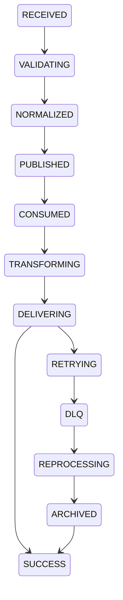

### 62.16 API Specification

```http
POST /api/v1/events
GET /api/v1/dlq
POST /api/v1/cache/reload
GET /api/v1/metrics
```

- API spec phải có request, response, error code và OpenAPI/Swagger definition.

### 62.17 Coding Standards

- Package structure phải theo bounded context.
- Naming convention thống nhất cho class, method, fields, tables, topics, and events.
- Error handling phải dùng typed exceptions hoặc error code chuẩn hóa.
- Logging convention phải có `traceId`, `correlationId`, `eventId`.
- Exception hierarchy phải tách business, validation, infrastructure, and integration exceptions.

### 62.18 Testing Strategy

| Test type | Requirement |
| --- | --- |
| Unit test coverage | ≥ 80% |
| Contract test | required |
| Consumer-driven contract | required |
| Mutation test | recommended for critical mapping logic |
| Chaos test | required for resilience validation |
| Performance benchmark | required |
| Soak test | required |
| Security test | required |
| Pen test | required |

### 62.19 Risks & Mitigations

| Risk | Impact | Mitigation |
| --- | --- | --- |
| Kafka down | High | retry, circuit breaker, alert |
| DB down | High | keep cache, freeze refresh |
| Cache corruption | High | snapshot, atomic swap, rollback |
| Huge file | Medium | chunking/streaming |
| Bad mapping | High | validation and approval workflow |
| Schema drift | High | versioning and compatibility |

### 62.20 Open Questions

- Do we need Avro or Protobuf as the long-term event contract format?
- Is schema registry a standalone service or embedded bounded service at first release?
- Which deployment strategy is mandatory for breaking changes: canary or blue/green?
- What is the exact retention policy for audit and DLQ by tenant/environment?

### 62.21 Appendices

- Architecture glossary.
- Topic naming standards.
- Error code catalog.
- Runbook checklist.
- Benchmark assumptions.
