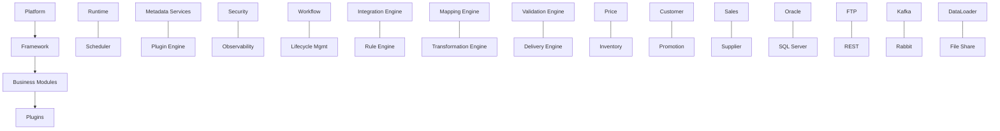
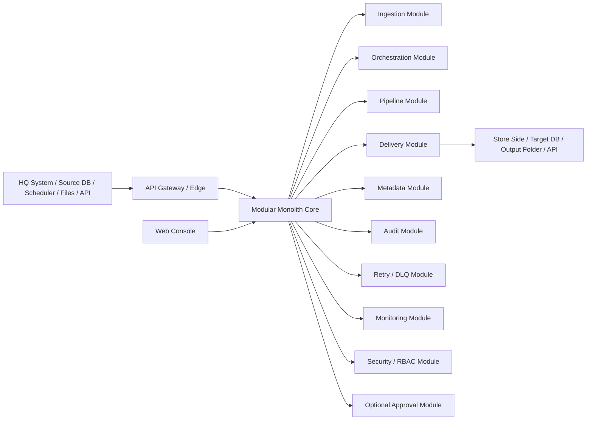
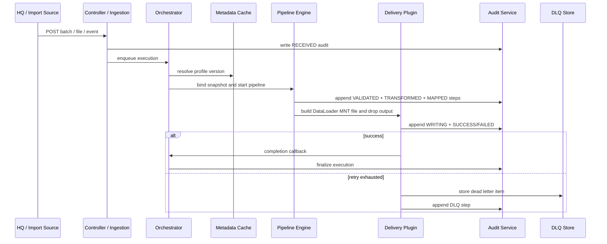
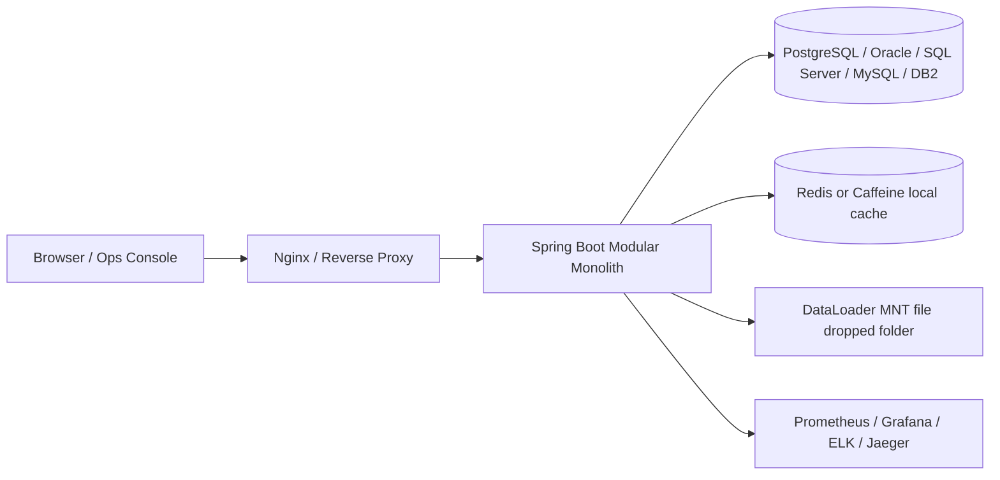

# Technical Design Document

## Unified Middleware Platform for HQ-to-Store Data Synchronization

**Document type:** target architecture and execution guide
**Scope:** enterprise middleware, DB-agnostic, modular-monolith-first, zero-hardcoded-field design
**Baseline inputs:** `TECHNICAL_DESIGN_ADIM.md`, `TECHNICAL_DESIGN_ADIM_NEW.md`, and `Price Integration Console.html`
**Current codebase anchor:** Java 17 + Spring Boot 3.3.2, in-memory mapping engine, DataLoader MNT file dropped output, initial audit and DLQ primitives

---

## 1. Purpose

This document defines the target technical architecture for a complete middleware platform that combines the intent of the two existing technical documents and extends them into an enterprise-grade, production-ready design.

The target system must:

- act as a system-agnostic integration layer, independent of customer hardware and software choices;
- support any relational database at both ends, including SQL Server, Oracle, MySQL, PostgreSQL, and DB2;
- process dynamic schemas with 100+ tables and 1000+ columns without code changes;
- avoid hardcoded fields and avoid cross-access into each side's database domain;
- provide high availability, retry, DLQ, audit, observability, RBAC, and retention;
- be delivered as a modular-monolith-first solution with a modern web console.

This is a design guide, not an implementation artifact. It is meant to steer build, test, deployment, and operations.

---

## 2. Design Goals

### 2.1 Business goals

- Receive inbound business events from HQ or from customer-defined import channels.
- Validate, transform, map, and route data to the destination store side.
- Support nightly batch, scheduled import, and event-driven ingestion.
- Provide a console for monitoring, configuration, retry, and governance.
- Allow operations teams to change mappings, profiles, templates, and routes without redeploying.

### 2.2 Platform goals

- No vendor lock-in on the database engine.
- No direct cross-DB access between HQ and Store zones.
- No hardcoded schema assumptions in the processing engine.
- Horizontal scale by adding instances, not by changing code.
- Configuration-driven behavior with cache reload and versioning.
- Full traceability from intake to final output or DLQ.

### 2.3 Non-goals

- Modifying source or target business systems directly.
- Writing custom business rules into code when they can be expressed as metadata.
- Tight coupling to one DB vendor or one transport.
- Replacing HQ or Store systems of record.
- Making the middleware responsible for pricing decisions.

---

## 3. Starting Point in the Repo

The current repository already contains the early stage of the engine:

- Java 17 / Spring Boot 3.3.2 backend.
- In-memory `MappingEngine`, `MappingContext`, `FieldRule`, `TableRule`.
- Validation, transformation, xref, DataLoader MNT writer, and output factory.
- Basic audit and DLQ artifacts.
- A bundled HTML console prototype.

The current hard-coded writer registry is the main place to evolve into a pluggable multi-target system.
The target design below preserves the useful parts of the current codebase while lifting the platform into a modular-monolith-first and metadata-driven architecture, with a clear extraction path for future services.

---

## 4. Core Principles

1. **DB-agnostic by contract**
   - The middleware may connect to many database vendors, but it never assumes a vendor-specific schema model in code.
   - All schema intelligence comes from metadata extraction and configuration.

2. **Zero hardcoded fields**
   - Column names, table names, keys, transforms, and output columns come from metadata profiles.
   - The engine works with descriptors, not fixed Java DTOs.

3. **No cross-zone DB access**
   - HQ and Store live in separate network and credential zones.
   - Each connector talks only to its own zone.
   - The middleware never queries one side's database from the other side's trust boundary.

4. **Configuration over code**
   - Routes, mappings, schedules, templates, retry policy, alert policy, and UI permissions are config-driven.
   - Reload without restart.

5. **Modular monolith first, extraction later**
   - The first production shape is a modular monolith with strict package and module boundaries.
   - High-churn or high-scale modules may be extracted later when operational pressure justifies it.

6. **Platform, framework, module, plugin layering**
   - The product is designed as a platform first, a reusable framework second, a business-module layer third, and a plugin layer at the edge.
   - Business logic stays in modules; reusable mechanics stay in the framework; vendor and channel specifics live in plugins.

7. **Safe by default**
   - Idempotent processing.
   - Lease-based work claiming.
   - Retry with bounded backoff.
   - DLQ on exhaustion.
   - Full audit trail.

8. **Explicit dependency rules**
   - Controller -> Application -> Domain -> Infrastructure is the default dependency direction.
   - Modules do not call each other directly when a port exists.
   - Delivery, Metadata, Audit, and Retry modules communicate through application ports rather than direct repository or service calls.

---

## 5. Target Architecture

### 5.0 Architectural posture

The default architecture is a modular monolith with clear internal layers:

- Platform
- Framework
- Business modules
- Plugins

The product should read as an Integration Platform, not only as middleware.

The Platform layer provides runtime, scheduler, metadata services, plugin engine, security, observability, and workflow coordination. The Framework layer provides reusable engines for integration, rules, mapping, transformation, validation, and delivery. The Business Module layer hosts the actual business domains. The Plugin layer adapts protocols, databases, files, and external systems.

The default architecture is a modular monolith with clear internal modules:

- Edge / gateway
- Ingestion module
- Orchestration module
- Pipeline module
- Delivery module
- Metadata module
- Audit module
- Retry / DLQ module
- Monitoring module
- Security / RBAC module
- Optional approval module

The modular monolith keeps transactional simplicity, reduces deployment overhead, and matches the current project maturity. The extraction path is deliberate: if a module gains independent scaling, latency, or lifecycle needs, it can later be promoted into a separate service without rewriting the domain model.

### 5.0.2 Layer map

### 5.0.1 Package structure

Recommended package layout:

- `com.example.middleware.bootstrap`
- `com.example.middleware.interfaceadapter`
- `com.example.middleware.application`
- `com.example.middleware.domain`
- `com.example.middleware.infrastructure`
- `com.example.middleware.configuration`

Or, feature-first by bounded context:

- `feature/ingestion`
- `feature/orchestration`
- `feature/pipeline`
- `feature/delivery`
- `feature/metadata`
- `feature/audit`
- `feature/retry-dlq`
- `feature/monitoring`
- `feature/security`
- `feature/approval`

The feature-first form is easier to scale in a modular monolith because it keeps each business capability visible and local.

### 5.1 Logical architecture

### 5.2 Service list

#### 5.2.1 Edge / API Gateway

- Terminates TLS.
- Routes intake and console traffic.
- Enforces rate limiting, IP policy, and request-size protection.
- Optionally hosts WAF rules.

#### 5.2.2 Modular Monolith Core

- Hosts all business modules in one deployable.
- Uses package and module boundaries to isolate responsibilities.
- Exposes module interfaces so later extraction does not change business contracts.
- Keeps a single transactional boundary where it is still operationally useful.

#### 5.2.3 Ingestion Module

- Accepts inbound batches, files, scheduled imports, or API events.
- Validates envelope-level syntax and authentication.
- Produces a canonical intake envelope.
- Persists a minimal idempotency record and hands off to orchestration.

#### 5.2.4 Orchestration Module

- Owns workflow state.
- Claims work with lease and heartbeat.
- Coordinates validate -> transform -> map -> build -> write -> finalize.
- Resubmits retriable work.
- Sends terminal failures to DLQ.

#### 5.2.5 Metadata / Mapping Module

- Stores metadata descriptors, profiles, rules, expressions, constraints, dependencies, versions, templates, and compatibility state.
- Manages source and target schema catalogs.
- Holds table rules, field rules, value maps, templates, route policies, version history, dependency graph, and compatibility metadata.
- Serves cached metadata to processors.
- Reloads without restart.
- Supports version rollback, blue-green metadata promotion, and compatibility checks before activation.

#### 5.2.6 Pipeline Module

- Coordinates the pipeline stages rather than hardcoding one linear processor.
- Runs validation, transformation, mapping, enrichment, template, and delivery stages.
- Supports optional compression, encryption, and masking stages.
- Builds canonical payloads and output artifacts.
- Never contains hardcoded business columns.
- Uses the rule engine rather than hardcoded if / else or switch branching.

Pipeline stages are first-class extension points, so adding `CompressionStage`, `EncryptionStage`, or `MaskingStage` does not require rewriting the engine.

#### 5.2.7 Delivery Module

- Writes DataLoader MNT files, calls APIs, publishes messages, or sends to FTP/SFTP/object storage.
- Supports multiple delivery plugins/adapters.
- Uses atomic delivery semantics when applicable.
- The default delivery seam is `DeliveryPlugin`, with concrete implementations such as `DataLoaderMntPlugin`, `ApiPlugin`, `KafkaPlugin`, `RabbitPlugin`, `FTPPlugin`, `SFTPPlugin`, `AzureBlobPlugin`, and `S3Plugin`.
- Plugin discovery can be configuration-driven or Spring bean driven.

The delivery plugin lifecycle is:

- `initialize()`
- `supports()`
- `validate()`
- `deliver()`
- `rollback()`
- `health()`
- `metrics()`

Each plugin advertises capability, configuration, health, and metrics.

#### 5.2.8 Audit Module

- Captures step-by-step execution logs.
- Stores per-step timing.
- Preserves status history and trace IDs.

#### 5.2.9 Retry / DLQ Module

- Stores terminal failed events.
- Exposes retry-again workflows.
- Keeps the original payload, failure reason, retry count, and operator notes.

#### 5.2.10 Monitoring Module

- Computes dashboard aggregates.
- Exposes health, readiness, liveness, and dependency checks.
- Surfaces SLA, throughput, latency, retry, and DLQ metrics.

#### 5.2.11 Web Console

- Separate frontend application.
- Built for operators, analysts, and admins.
- Supports dashboards, audit, mappings, approvals, retries, and system settings.
- Approval is optional and can be disabled per deployment profile.

### 5.3 Dependency rules

- `Controller` depends only on `Application` ports.
- `Application` orchestrates use cases and depends on `Domain` abstractions.
- `Domain` has no dependency on web, database, message broker, or file system classes.
- `Infrastructure` implements ports and is replaceable.
- `Delivery` cannot depend directly on `Metadata` internals; it receives resolved profiles and canonical payloads from `Application`.
- `Metadata` cannot call `Delivery` directly; it exposes read/write ports only.

---

## 6. Recommended Technology Stack

### 6.1 Backend

- Java 17
- Spring Boot 3.3.x
- Spring Web / WebFlux where needed
- Spring Security
- Spring Data JPA for metadata and workflow state
- Spring JDBC / jOOQ for vendor-neutral SQL execution where needed
- Spring Retry
- Spring Scheduling
- Spring Validation
- OpenAPI 3
- Flyway for migrations
- Micrometer + OpenTelemetry
- MapStruct for explicit DTO mapping where static DTOs are useful
- Testcontainers for integration tests

### 6.2 Data access

- Primary persistence layer must be vendor-pluggable.
- Supported runtimes should include Oracle, SQL Server, MySQL, PostgreSQL, and DB2.
- Use JDBC abstractions and SQL dialect adapters.
- Prefer metadata discovery and generated row descriptors over compile-time schema coupling.

### 6.2.1 Cache strategy

The platform should support versioned immutable metadata snapshots backed by pluggable caches:

- local in-memory cache: Caffeine;
- distributed cache: Redis or Hazelcast;
- eviction strategy: explicit version invalidation plus time-based TTL fallback.

Recommended behavior:

- a metadata update publishes a refresh event;
- the cache stores immutable snapshots, never mutable live objects;
- consumers invalidate the affected snapshot version;
- readers reload lazily on next access;
- each execution binds to one snapshot version for its full lifecycle;
- no execution reads metadata directly after start; it always reads the bound snapshot.

### 6.3 Messaging / workflow

- Database-backed work queue is the primary workflow backbone for this product stage.
- It is sufficient for the receive -> validate -> transform -> write lifecycle and keeps the operational footprint small.
- Kafka is optional and should be introduced only when volume, integration fan-out, or multi-consumer needs justify it.
- RabbitMQ or JMS-compatible broker can also be enabled as an alternative deployment profile when a customer prefers broker semantics.
- Any broker remains an adapter, not a mandatory platform dependency.

### 6.4 Frontend

- React 18
- TypeScript
- Vite
- Ant Design or Material UI for enterprise console components
- ECharts or Recharts for dashboards
- React Router
- TanStack Query for server state

The current bundled HTML file is treated as a prototype. The target console should be a real SPA with role-based navigation, audit views, and operational dashboards.

### 6.5 Deployment

- Docker images per service.
- Kubernetes preferred for production.
- Docker Compose for local development and demo environments.
- Ingress controller / API gateway at the edge.
- Config maps and secrets externalized.

---

## 7. Metadata-Driven Data Model

### 7.1 Canonical principle

The engine should not map directly from one database schema to another with hardcoded Java fields. Instead, it should:

1. read schema metadata;
2. normalize that metadata into a canonical table/column description;
3. apply profile rules;
4. transform data into an intermediate canonical event model;
5. render the output artifact using target templates.

### 7.1.1 Canonical record model

The canonical model is the stable internal contract between intake, transformation, validation, and delivery.

Recommended shape:

- `CanonicalEvent`
   - `eventId`
   - `eventType`
   - `sourceSystem`
   - `targetSystem`
   - `correlationId`
   - `traceId`
   - `metadataHeaders`
   - `schemaVersion`
   - `receivedAt`
   - `payload`

- `CanonicalRecord`
   - `recordId`
   - `tableName`
   - `operationType`
   - `primaryKey`
   - `columnValues` as `Map<String, Object>`
   - `validationStatus`
   - `mappingStatus`
   - `transformStatus`
   - `errorList`

- `CanonicalPayload`
   - `records`
   - `summary`
   - `checksum`
   - `rowCount`
   - `columnCount`

This canonical layer is what makes the engine agnostic to source and target DB vendors. Source-specific and target-specific details stay outside the core processing contract.

### 7.2 Generic descriptors

- `SourceSystem`
- `TargetSystem`
- `ConnectionProfile`
- `SchemaProfile`
- `TableDescriptor`
- `ColumnDescriptor`
- `KeyDescriptor`
- `MappingProfile`
- `TransformRule`
- `ValidationRule`
- `DeliveryProfile`
- `RetryPolicy`
- `AlertPolicy`
- `RBACPolicy`
- `RetentionPolicy`

### 7.3 Support for 100+ tables and 1000+ columns

The design must support large schemas by:

- storing metadata separately from execution code;
- using indexed catalog tables;
- loading profiles lazily;
- using stream processing rather than loading the full payload into memory;
- supporting table-level rules, field-level rules, and cross-table dependencies;
- resolving outputs by rule sets rather than fixed DTOs;
- tracking schema version and compatibility state for every profile;
- validating schema deltas before activation;
- allowing rollback to a previous compatible profile;
- resolving dependencies between tables, views, or derived entities before processing begins.

### 7.4 Zero hardcoded fields pattern

- Code reads `TableDescriptor` and `ColumnDescriptor`.
- Rules reference field names stored in metadata.
- Output templates are generated from metadata.
- Validation messages refer to descriptor names, not Java class fields.

### 7.5 Metadata versioning and compatibility

Metadata must be versioned and lifecycle-managed.

- Each profile has a semantic version or monotonically increasing revision.
- A profile can be Draft, Validated, Active, Deprecated, or RolledBack.
- Activation requires compatibility validation against the source and target schema snapshot.
- Cache invalidation must be event-driven or version-poll based.
- A running batch always binds to one stable metadata version so execution is deterministic.
- If a metadata update is incompatible, the previous active version remains in service.

### 7.6 Rule engine

Business rules must not collapse into hardcoded if / else / switch trees.

Recommended approach:

- primary layer: `Rule -> Expression -> Function -> Condition -> Action -> Context`;
- expression layer: declarative rules stored in metadata;
- function registry layer: reusable functions such as `round()`, `substring()`, `lookup()`, `currency()`, and `date()`;
- advanced extension layer: a sandboxed JSR-223 script engine only when the customer explicitly enables scripted rules;
- governance: rule versioning, validation, preview, and rollback from the console.

Groovy or other script engines should be treated as optional extensions, not the default contract. The default path should stay declarative so the platform remains auditable and safe.

Rule evaluation example:

- Condition: `price > 0`
- Action: `round(price)`
- Function registry: `round()`, `substring()`, `lookup()`, `currency()`, `date()`

### 7.7 Domain model

The domain model should be explicit and stable.

Core entities and value objects:

- `IntegrationProfile`
- `ConnectionProfile`
- `SchemaProfile`
- `MappingProfile`
- `Execution`
- `ExecutionItem`
- `ExecutionStep`
- `DeliveryJob`
- `NotificationRule`
- `RetentionPolicy`
- `AuditEvent`
- `DeadLetterItem`
- `RuleDefinition`
- `ProfileVersion`

Suggested relationships:

- `IntegrationProfile` owns one or more `ConnectionProfile`, `SchemaProfile`, and `MappingProfile` entries.
- `Execution` represents one processing run and owns many `ExecutionItem` rows.
- `ExecutionItem` owns many `ExecutionStep` records.
- `DeliveryJob` is derived from an `Execution` when the target artifact is ready.
- `AuditEvent` is append-only and references `Execution` or `ExecutionItem`.
- `DeadLetterItem` captures terminal failures with original payload and reason.

### 7.8 Execution state machine

The workflow needs a strongly typed state machine rather than free-form text status.

Recommended enum:

- `RECEIVED`
- `VALIDATING`
- `VALIDATED`
- `TRANSFORMING`
- `MAPPING`
- `ENRICHING`
- `TEMPLATING`
- `WRITING`
- `SUCCESS`
- `PARTIAL`
- `FAILED`
- `DLQ`

Optional finer-grained states:

- `QUEUED`
- `CLAIMED`
- `RETRY_WAIT`
- `ROLLED_BACK`
- `REPLAYED`

State transitions should be validated by the application layer and enforced by the domain model.

### 7.9 Transaction strategy

The platform should use explicit transaction boundaries instead of letting them emerge accidentally.

Recommended strategy:

- Intake writes the execution header, idempotency record, and audit seed in one local transaction.
- Orchestration claims work in a short transaction and releases the lock before long-running validation or output work begins.
- Audit append operations are local and transactional.
- Outbox pattern is recommended for any cross-process event publication so notifications and cache invalidation are not lost on crash.
- Saga-style compensation is used only when a multi-step business rollback is truly required; it is not the default for file drop processing.

Practical rule:

- use local ACID transactions inside the modular monolith;
- use outbox for asynchronous side effects;
- avoid distributed transactions unless a future extraction makes them unavoidable.

### 7.10 Plugin architecture

The platform should expose plugin ports for every variable integration concern.

Every plugin should follow the same lifecycle and capability contract:

- lifecycle
- capability
- configuration
- health
- metrics

Recommended plugin types:

- `IngestionPlugin`
- `TransformationPlugin`
- `ValidationPlugin`
- `DeliveryPlugin`
- `NotificationPlugin`
- `RetentionPlugin`
- `HealthCheckPlugin`
- `RuleEnginePlugin`

### 7.11 Extension SDK

If the product is sold as a framework or platform, customers should be able to add their own JAR-based extensions without modifying the core.

Recommended extension types:

- `CustomValidationPlugin`
- `CustomDeliveryPlugin`
- `CustomRulePlugin`
- `CustomNotificationPlugin`
- `CustomTemplatePlugin`

Extension SDK rules:

- custom extensions are packaged as signed JARs;
- extensions are discovered through the plugin registry;
- extensions expose the same lifecycle methods as first-party plugins;
- extension classes are isolated from the core by package and classpath boundaries;
- an extension failure must not crash the host runtime;
- extension metadata is versioned and visible in the console.

Concrete delivery plugins may include:

- `DataLoaderMntPlugin`
- `ApiPlugin`
- `KafkaPlugin`
- `RabbitPlugin`
- `FTPPlugin`
- `SFTPPlugin`
- `AzureBlobPlugin`
- `S3Plugin`

The plugin contract should be small and stable; plugin implementations can evolve without changing the core orchestration path.

---

## 8. Workflows

### 8.1 Main success path

1. Intake receives an event, file, or scheduled job trigger.
2. Authentication and request-shape validation pass.
3. Idempotency check confirms the event is new.
4. Orchestrator claims the work using a lease.
5. Metadata service provides source and target profile rules.
6. Pipeline engine resolves the snapshot and initializes the stage chain.
7. Validation stage, transformation stage, mapping stage, and enrichment stage execute in order.
8. Template stage renders the target artifact.
9. Delivery stage writes or publishes the output.
10. Audit records are finalized.
11. Monitoring counters are updated.
12. The workflow ends in WRITTEN or SUCCESS.

### 8.2 Retry and DLQ path

- If the write step fails, the engine retries with bounded exponential backoff.
- If the retry budget is exhausted, the item moves to DLQ.
- Operators can retry from the console after the root cause is fixed.

### 8.3 Lease and HA path

- Two or more instances may process simultaneously.
- Only one instance can own a work item at a time.
- If a node dies, the lease expires and another node reclaims the job.
- No double write is allowed.

### 8.4 Scheduled import path

The platform must support multiple intake modes:

- API webhook
- scheduler-based poller
- FTP/SFTP folder watcher
- message queue consumer
- optional batch file drop

This is important because customer environments vary widely and should not force one integration shape.

### 8.5 Sequence diagram

---

## 9. Functional Scope by Stage

### Stage 1 - Core Engine

- Receive API
- Validate
- Transform
- Mapping
- Enrichment
- Template
- DataLoader MNT writer
- Output folder

### Stage 2 - Idempotency

- Avoid processing the same event twice
- Persist `processed_event`
- Track `eventId`, `checksum`, `status`, `createdAt`

### Stage 3 - Lease and HA

- Claim work with lease
- Support node crash recovery
- Reclaim on timeout
- Active-active processing

### Stage 4 - Retry

- Retry 1 -> Retry 2 -> Retry 3 -> DLQ
- Policy configurable per target and per error class

### Stage 5 - DLQ

- Persist failed events
- Store payload, reason, retryCount, timestamps
- Retry Again action in console

### Stage 6 - Full Audit

- RECEIVED -> VALIDATING -> VALIDATED -> TRANSFORMING -> MAPPING -> ENRICHING -> TEMPLATING -> WRITING -> WRITTEN
- Store per-step execution time

### Stage 7 - Monitoring

- Dashboard cards
- Realtime throughput and health
- Success / failed / partial / retry / DLQ counters

### Stage 8 - Alerting

- Email by default
- Pluggable channels: Teams, Slack, Discord, SMS
- Template-driven notifications

### Stage 9 - Retention

- 90-day retention policy by default or customer-configured value
- Archive then purge
- Scheduled job at 02:00 AM or customer-configured time

### Stage 10 - RBAC

- Viewer
- Operator
- Business Analyst
- Admin

### Stage 11 - Dynamic Configuration

- No hardcoded delimiter, header, folder, retry mail, or topic names
- Store in DB + cache + reload
- No restart required

### Stage 12 - Multi-Channel Scheduler

- Webhook
- Scheduler
- FTP import
- Folder import
- MQ import

### Stage 13 - High Availability

- 2+ instances
- Lease-based safety
- No duplicate processing

### Stage 14 - Metrics

- Average processing time
- MNT generation time
- Validation time
- Write time
- Pipeline stage timing
- CPU / memory / I/O trend

### Stage 15 - Health Check

- Database
- Folder or bucket
- Disk
- Kafka / queue
- Mail or notification provider

### Stage 16 - Template Email

- Success / partial / failed templates
- Editable in UI
- Versioned and auditable

### Stage 17 - Workflow Approval

- Optional approval module for customers that require human review
- Disabled by default unless a deployment profile enables it
- Business Analyst -> Submit -> Manager -> Approve -> Engine -> Generate

---

## 10. Security and Compliance

### 10.1 Authentication and authorization

- OAuth2 / OIDC for console users.
- Machine authentication for system-to-system ingestion.
- Role-based access control for all admin actions.
- Least privilege by service account.

### 10.2 Network boundaries

- Separate trust zones for HQ, middleware, and Store.
- No direct cross-zone DB access.
- Only approved routes and ports are open.
- Mutual TLS may be enabled where required.

### 10.3 Secret management

- Secrets are never hardcoded.
- Use external secret vault or platform secret manager.
- Rotate without redeploy where supported.

### 10.4 Data protection

- Encrypt in transit and at rest.
- Mask sensitive values in logs and UI.
- Keep audit records immutable or append-only.

---

## 11. Observability

### 11.1 Metrics

- Ingest rate
- Processing latency
- Validation failure rate
- Retry count
- DLQ count
- Success / partial / failed counts
- Queue depth
- Lease expiry count
- File write duration
- Metadata cache hit ratio
- Metadata version roll-forward / rollback count
- Rule evaluation duration

### 11.2 Logs

- Structured JSON logs
- Trace ID / correlation ID
- Event ID on every log line
- No secret values in logs

### 11.3 Traces

- OpenTelemetry traces across services
- Span per stage of workflow
- End-to-end correlation from intake to delivery

### 11.4 Observability stack

Recommended production stack:

- Prometheus for metrics collection
- Grafana for dashboards and alert panels
- OpenSearch or ELK for log search and retention
- Jaeger or Tempo for distributed traces
- Alertmanager or an equivalent notification router for paging and escalation

### 11.6 Quantitative NFR targets

The design should be explicit about measurable targets:

- API acceptance latency: p95 under 100 ms for a normal-sized batch acknowledgement.
- Validation stage latency: p95 under 500 ms for a 10k-record batch on standard hardware.
- End-to-end processing latency: p95 under 5 minutes for a standard nightly batch.
- Output artifact build time: p95 under 500 ms for medium batches and bounded linearly for larger ones.
- Throughput: at least 1,000 records/sec in steady state, with scale-out to 10,000 records/sec under parallel processing profiles.
- Availability: 99.9% for the core platform in a 2-node active-active deployment; 99.99% if the customer provisions redundant edge, cache, and storage layers.
- Recovery time objective: under 5 minutes for a single-node failure.
- Recovery point objective: near-zero for committed workflow state when the outbox and audit tables are replicated.
- Metadata reload time: under 30 seconds from publish event to cache refresh in normal operating conditions.
- Plugin initialization time: under 2 seconds per plugin on a warm JVM.
- Rule evaluation latency: under 10 ms for a normal rule set.

### 11.5 Dashboard

The console should show at minimum:

- Today processed
- Success
- Failed
- Partial
- Retry
- DLQ
- Current leases
- Recent alerts
- Recent audit events

---

## 12. Testing Strategy

### 12.1 Unit tests

- Validation rules
- Mapping rules
- Transformation rules
- Idempotency checks
- Lease state transitions
- Retry policy behavior
- DLQ serialization
- RBAC permission checks

### 12.2 Component tests

- Ingestion service
- Orchestration service
- Metadata service
- Delivery service
- Audit service
- Notification service

### 12.3 Contract tests

- API contract for intake and console
- Message contract for queue events
- Schema contract for metadata profiles
- Notification payload contract

### 12.4 Integration tests

- Database compatibility matrix
- Queue compatibility matrix
- File system delivery tests
- FTP / SFTP / API delivery tests
- Failure and retry scenarios
- Lease failover scenarios

### 12.5 End-to-end tests

- Batch intake -> validation -> mapping -> build -> write -> audit -> dashboard
- Duplicate batch ignored
- Failed write retried then DLQ
- Node crash reclaimed by lease timeout
- Mapping changed in UI without restart

### 12.6 Non-functional tests

- Load test for 100+ tables and 1000+ columns
- Long-running batch test
- Failover test
- Security test
- Retention test
- Backup and restore test

### 12.7 Test frameworks

- JUnit 5
- Mockito
- Testcontainers
- RestAssured or WebTestClient
- Playwright for console E2E
- Gatling or JMeter for performance

---

## 13. Runtime Scenarios

### 13.1 Duplicate event

If the same event arrives twice, only the first one is processed. The second one is ignored by checksum and idempotency key.

### 13.2 Crash and reclaim

If a worker crashes mid-process, the lease expires and another node claims the event.

### 13.3 Retry exhaustion

If the write target remains unavailable after all retries, the event lands in DLQ and an alert is sent.

### 13.4 Partial processing

If some records are invalid, the valid ones continue and the result is PARTIAL with per-record reasons stored.

### 13.5 Dynamic schema change

If a customer adds a table or a column, the metadata profile changes; the engine reloads it and continues without code change.

---

## 14. Console UX Principles

The web console should be an enterprise dashboard, not a demo page.

Recommended UI characteristics:

- clear operational hierarchy;
- sticky filters and search;
- event detail drawer;
- audit timeline;
- retry and DLQ action panels;
- profile editor with validation hints;
- role-aware navigation;
- metrics cards and live charts.

Frontend stack recommendation:

- React 18
- TypeScript
- Vite
- Ant Design or Material UI
- ECharts for charts
- React Router
- TanStack Query

This is the best fit for a maintainable enterprise console aligned with the current Java backend.

### 14.1 Console modules

- Dashboard
- Event history
- Audit viewer
- Retry and DLQ operations
- Metadata editor
- Rule preview and validation
- RBAC administration
- Notification template editor
- Health and dependency view
- Optional approval inbox

---

## 15. Deployment Model

### 15.1 Production topology

- API Gateway / Ingress
- Modular Monolith Core / Framework Runtime
- Web Console
- Optional external Notification Adapter
- Cache
- Observability stack
- Message broker only where the deployment profile requires it

### 15.4 Physical architecture

Recommended physical deployment for a typical enterprise installation:

Notes:

- The database box is intentionally vendor-neutral.
- The cache may be local or distributed depending on deployment size.
- The file drop folder is a first-class physical artifact because the output is a DataLoader MNT file dropped to the downstream boundary.
- The same physical topology can run on-prem, VM-based, or container-based infrastructure.

### 15.2 Runtime options

- Kubernetes cluster for production
- Docker Compose for local development
- Helm or Kustomize for deployment packaging

### 15.3 Environment separation

- Dev
- Test
- UAT
- Pre-prod
- Prod

---

## 16. Roadmap Alignment

This section maps the target document to the implementation evolution already outlined by the user.

- Phase 1: core engine already exists in partial form.
- Phase 2: idempotency tables and logic.
- Phase 3: lease and HA.
- Phase 4: retry and bounded backoff.
- Phase 5: DLQ and retry-again console action.
- Phase 6: full audit trail with timing.
- Phase 7: realtime monitoring dashboard.
- Phase 8: alerting channels.
- Phase 9: retention and archive.
- Phase 10: RBAC.
- Phase 11: dynamic configuration.
- Phase 12: multiple intake channels.
- Phase 13: active-active HA.
- Phase 14: metrics.
- Phase 15: health checks.
- Phase 16: email templates.
- Phase 17: optional approval workflow.

The implementation should proceed in this order unless a customer constraint forces a different priority.

---

## 17. Technology Decision Summary

### Chosen backend stack

- Java 17
- Spring Boot 3.3.x
- Spring Security
- Spring Data
- Spring Retry
- Spring Validation
- Flyway
- Micrometer / OpenTelemetry
- Testcontainers
- Spring Expression Language for safe rule evaluation

### Chosen frontend stack

- React 18
- TypeScript
- Vite
- Ant Design or Material UI
- ECharts

### Chosen integration stack

- REST / JSON for synchronous control-plane APIs
- Database queue for primary workflow orchestration
- Kafka or RabbitMQ only as optional transport adapters
- JDBC-based adapters for DB-agnostic access
- File / FTP / SFTP / API writers for output adapters

### Chosen architectural style

- Modular monolith first, service extraction later
- Metadata-driven domain model
- Hexagonal / ports-and-adapters boundary
- Lease-based workflow orchestration
- Event-driven delivery

---

## 18. Acceptance Criteria for the Target Design

The architecture is acceptable only if all of the following are true:

- It supports multiple DB vendors without code rewrite.
- It can process schema growth without hardcoded fields.
- It avoids cross-zone DB access.
- It supports idempotency, lease, retry, DLQ, audit, metrics, alerting, and RBAC.
- It has a console for operations and configuration.
- It has a unit/integration/e2e test strategy.
- It can be deployed independently of customer-specific hardware assumptions.
- It can be operated with safe rollback and observability.

---

## 19. Appendix - Suggested Implementation Order

1. Convert the current engine into a metadata-driven core.
2. Introduce canonical event, schema, and mapping descriptors.
3. Add idempotency persistence and checksum handling.
4. Add lease-based claiming and failover recovery.
5. Add retry policy and DLQ.
6. Expand audit to step-level timing and status history.
7. Build dashboard, RBAC, and configuration UI.
8. Add pluggable intake and delivery channels.
9. Add compatibility tests across supported DB vendors.
10. Add runtime validation and performance gates.

---

## 20. Closing Statement

This document is the target blueprint for a real enterprise middleware platform: DB-agnostic, schema-flexible, horizontally scalable, operationally safe, and ready for production use.

It intentionally preserves the useful ideas from the existing technical documents while upgrading the system into a modular-monolith-first, metadata-driven, customer-agnostic integration platform with a staged path to service extraction.
